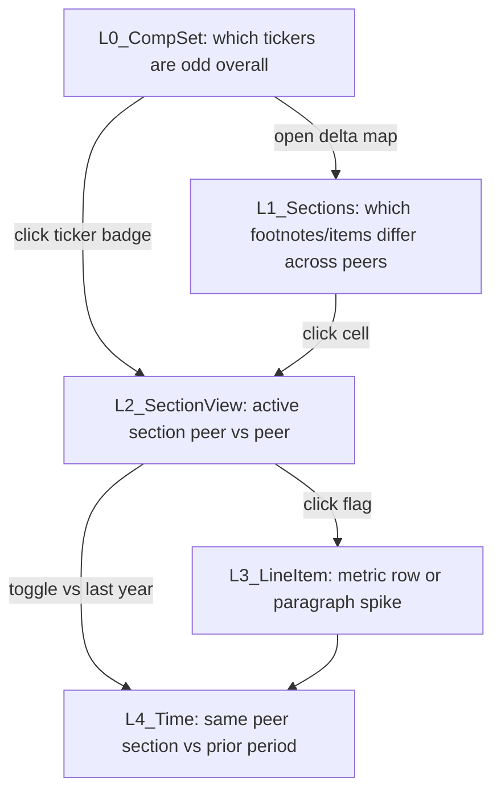
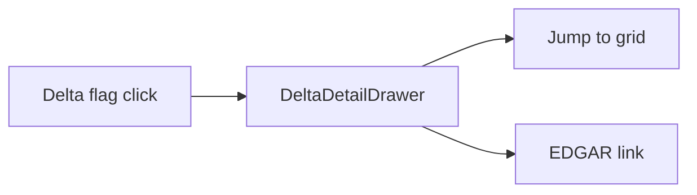
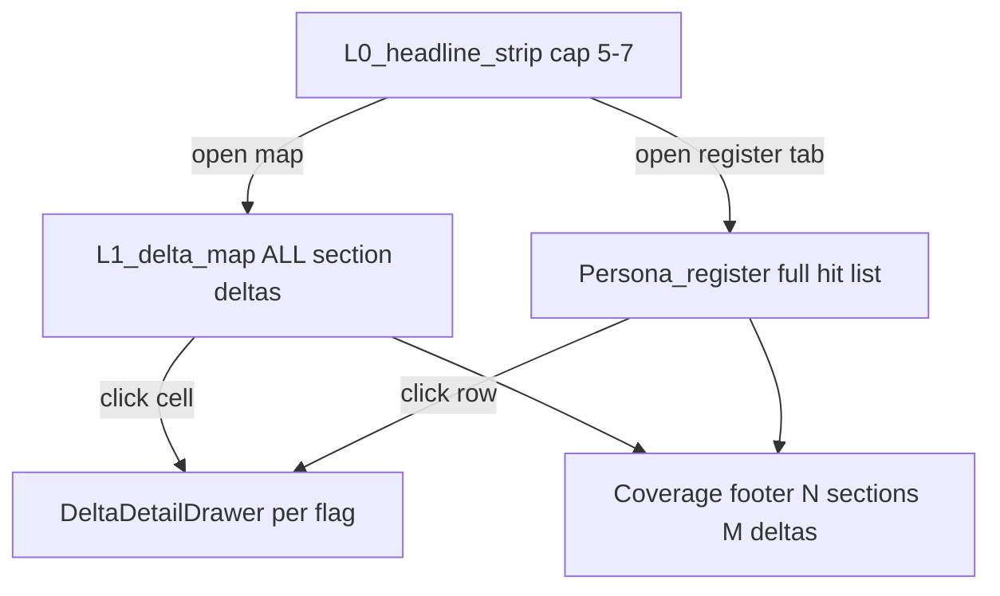

# Peer Delta Discovery — Product Roadmap

**Purpose:** PD wins by spotting deltas at every zoom level — comp set, section, peer, line, and time — using tagged filing data under the hood without ever exposing "XBRL" to users. Outliers are the hook; the grid is the drill-down.

**Document:** Implementation roadmap for the Peer Disclosures compare grid ([`CompareGrid`](../components/compare/CompareGrid.tsx)).

| | |
|---|---|
| **Last updated** | 2026-06-28 |
| **Status** | **Phase 1 shipped** — L0 strip + L1 map on compare load; Phase 2 drawer/L2–L3 depth; Phase 3 L4 |

---

## Product thesis

**Nobody cares about XBRL.** Most people will never know or need to know what it is, what it was meant to do, or why it under-delivered. **Everyone cares about deltas** — what's different, missing, bigger, new, or only true of one name in the group.

PD becomes interesting when it is a **powerful layered delta spotter**: the same mental model at every zoom level — *something here doesn't match the pattern* — with one click to expand **what changed** in filing evidence (tags + disclosure excerpts), then jump to the grid or EDGAR if they want the full section.

**Tagged filing data (companyfacts, note facts, iXBRL where needed) is implementation only.** User-facing language is always plain: "2× peers," "only AMZN," "changed vs last year," "missing footnote," never "concept," "extension," or "XBRL."

---

## Delta zoom levels (L0–L4)

Same pattern at each level: **scan → rank deltas → highlight → click to open detail drawer**.



| Level | User question | UI surface | Primary data source |
|-------|---------------|------------|---------------------|
| **L0** | "Who in my group is the outlier?" | Column header heat + **headline Deltas strip** (5–7 cap, severity-ranked — glance only, not the complete catalog) | Coverage + aggregate flag count per ticker |
| **L1** | "Which topics differ across peers?" | Section delta map (presence / missing / changed) | `ParseResponse` sections + optional PY metadata |
| **L2** | "On this footnote, who's different?" | Inline highlights in synchronized grid | Section text (lazy) + note facts |
| **L3** | "Which line or paragraph?" | Row highlight in metrics table or excerpt span | Tagged facts (internal) + keyword rules |
| **L4** | "What changed for this name vs last year?" | Column toggle **vs last year** on active section | Prior period fetch + text/tag diff |

**Navigation rule:** Every flag carries `{ level, ticker, section_id, optional row_key, optional period }` so navigation always deepens one level without a new product surface.

---

## What users want (never mention XBRL)

| Hook (flashy, mainstream) | Deeper study (after click) |
|---------------------------|----------------------------|
| "NVDA revenue +40% vs peer median growth" | Open `financial-statements` or `note-revenue` |
| "AAPL EPS 2× peer median this year" | Headline metrics row + `note-eps` |
| "MSFT effective tax rate outlier vs peers" | `note-income-tax` + metrics table |
| "GOOGL missing lease note — peers have it" | Open `note-leases`, read peer columns |
| "Only MSFT disclosed impairment" | `note-impairment` + keyword context |
| "Only NVDA changed revenue policy language" | PY→CY excerpt diff on `note-revenue` |
| "Only AMZN cites ASC 326 in allowance note" | `note-allowance` + matching excerpt |
| "Inventory: only peer using LIFO" | `note-inventory` + phrase highlight |
| "Peers reference different revenue standards" | `note-revenue` + ASC mention diff |
| "Only peer with open SEC staff comments" | `note-sec-comments` / risk factors + excerpt |
| "Only peer disclosed material weakness" | `note-internal-control` + keyword context |
| "Qualified opinion — only name in group" | Auditor report area + opinion excerpt |
| "Open tax position narrative vs peers" | `note-income-tax` + UTP language |
| "Resolved going-concern language vs last year" | PY→CY on going-concern / MD&A |
| "Filing amended" | Column trust badge + EDGAR link |

Deltas **lead**; reading **follows**. PD is interesting at a glance, not only after 20 minutes of scrolling.

---

## Delta detail drawer (on click)

**Purpose:** Expand a delta with **what changed** from filing evidence — tags (as human line labels + amounts) + disclosure excerpts — **not** why, cause, or source attribution.

Every delta flag in the strip, map, or inline highlight opens the **same drawer** on click. Personas affect **strip ranking only**; drawer content is identical for all users.

### UI (drawer / side panel)

| Block | Content |
|-------|---------|
| **Header** | Delta label, ticker, fiscal period, source `section_id` (plain name) |
| **Tagged amounts** | Table rows: human line label + amount for flagged ticker; peer median or peer rows when relevant |
| **Disclosure excerpts** | Matching sentence/paragraph spans from section text (lazy-loaded on click) |
| **Peer contrast** | Factual only: *"Others unchanged"* or short peer quote(s) — no interpretation |
| **PY/CY diff** *(Phase 3)* | **REMOVED** (prior period) + **ADDED** (current period) excerpt blocks |
| **Also flagged** *(optional)* | Neutral links to other deltas on same ticker — no correlated-flag narrative |
| **Actions** | **Jump to grid** (scroll + highlight section/row) · **Open EDGAR** (accession + anchor when available) |

### Product guardrails

- **No LLM**, no *"likely due to"*, no driver checklists, no hypothesis or suggested-review language
- **No cause/source attribution** — show filing text and tagged numbers only
- **Lazy load on click:** `fetchSectionText` for active section; prior-period fetch only when drawer needs PY/CY blocks
- **Same drawer for all personas** — presets in [`lib/delta-rank.ts`](../lib/delta-rank.ts) reorder the strip, not drawer layout or copy

### Delta flag → drawer content (examples)

| Delta flag type | Drawer shows (factual) |
|-----------------|------------------------|
| **`headline_vs_median`** (revenue outlier) | Tagged revenue line label + CY amount; peer amount table; optional YoY from `annual_summary`; **MD&A excerpt block** when `mda_driver_mention` cross-link (Results of Operations spans) |
| **`missing_section`** | *Section not present* for flagged ticker; peer excerpt(s) showing note exists in others |
| **`treatment_only_peer`** (LIFO vs WAC) | Inventory policy excerpt with matched phrase (e.g. LIFO); peer excerpts with FIFO / weighted-average wording |
| **`asc_mention_gap`** | Sentence citing ASC topic; peer contrast (*"No ASC 326 citation in other columns on this note"*) |
| **`section_changed_py`** / **`treatment_py_change`** | **REMOVED** PY policy excerpt + **ADDED** CY excerpt (Phase 3) |
| **Tagged fact appeared/vanished** (L4) | CY tagged row present; PY row absent or zero — internal tag diff, human labels only |
| **`open_staff_comments`** / **`only_peer_open_staff`** | Item 1B (`unresolved-staff`) substantive excerpt; peers show *"none"* or section absent |
| **`controls_weakness_open`** (MW) | `controls` excerpt with material-weakness phrase; peer contrast if others silent |
| **`tax_rate_outlier`** | Effective tax rate tagged/derived row + `note-income-tax` reconciliation excerpt if loaded |

### Drawer integration



Strip (L0), section delta map (L1), inline highlights (L2–L4), and column **vs last year** badges route through [`DeltaDetailDrawer.tsx`](../components/compare/DeltaDetailDrawer.tsx) **(Phase 2+)**. Phase 1 strip/map click → grid scroll only.

**Lib:** [`lib/delta-detail.ts`](../lib/delta-detail.ts) — `buildDeltaDetail(flag, sessionState) → { tagRows, excerpts, peerContrast, pyCyDiff?, links }`; composes lazy fetches; no inference layer.

---

## Headline financial metric deltas (revenue, EPS, net income, tax)

**Highest-signal deltas for analysts and general users** — often more "flashy" than footnote prose. Data already loads on compare open via [`fetchFinancialsBatch`](../components/compare/CompareGrid.tsx) / [`METRIC_CONCEPTS`](../backend/sec/xbrl_client.py) (revenue, net income, operating income, EPS basic/diluted, assets, cash). **No new paywall** — same Free/Pro period and column gates.

### Metric families (user labels only)

| Family | Keys (internal) | Where user drills |
|--------|-----------------|-------------------|
| **Top-line & profitability** | `revenue`, `net_income`, `operating_income`, `gross_profit` | `financial-statements` → optional `note-revenue` |
| **Per-share** | `eps_basic`, `eps_diluted` | `financial-statements` → `note-eps` |
| **Tax** | `income_tax` (expense), `income_before_tax`; note-level: `income_tax_expense`, `deferred_tax_assets`, `deferred_tax_liabilities`, `effective_tax_rate` | `financial-statements` → `note-income-tax` |
| **Balance-sheet headline** | `total_assets`, `total_liabilities`, `stockholders_equity`, `cash` | `financial-statements` |

*Tax payable:* map to **deferred tax liabilities** + **income tax expense** outliers (filers rarely tag "payable" consistently); label as "tax expense / deferred tax outlier" not "IncomeTaxesPayable."

### Delta rules (headline metrics)

| ID | Rule (same FY, loaded peers) | Example label |
|----|------------------------------|---------------|
| `headline_vs_median` | Active **FY level** >1.5× peer median (or <0.5×) on revenue, net income, op income, EPS — **not YoY %** (YoY → `headline_py_spread`, Phase 2) | "NVDA revenue well above peer median" |
| `headline_only_peer` | Only one ticker with material value or only one negative EPS | "Only META negative net income" |
| `headline_py_spread` | Own YoY change vs peer median YoY change (L4-lite on bootstrap) | "EPS grew 80% vs peers' 12% median" |
| `tax_rate_outlier` | Effective tax rate (derived or tagged) vs peer median ± threshold | "Effective tax rate 8 pts below peers" |
| `margin_outlier` | Derived net margin or op margin vs peers | "Net margin 2× peer median" |

**Level placement:**

- **L0:** Roll up headline outliers into column heat + Delta strip on load (financials already streaming).
- **L3:** Row highlight in [`XbrlMetricsPanel`](../components/compare/FilingColumn.tsx) when user is on `financial-statements` or tax/revenue notes.
- **L4:** Prior-year same metric from `annual_summary` arrays (no extra fetch if 2+ years in series; else lazy prior period).

**Phase assignment:** Ship **`headline_vs_median` + `headline_only_peer`** in **Phase 1** (data on load). **`headline_py_spread` + `tax_rate_outlier` + `margin_outlier`** in **Phase 2** (needs YoY series or note-level tax tags).

**Guardrails:** Compare **same fiscal period** only; show "as reported" tooltip; skip outliers when &lt;2 peers have data; never show raw tag names.

---

## Domestic vs foreign filer compare nuances

PD already supports mixed comp sets (10-K/10-Q beside 20-F/6-K) via period merge and shared section catalog. **Delta detection must treat domestic and foreign columns differently for tagged metrics** while keeping narrative compare useful. Implementation detail lives in [`filing_periods.py`](../backend/sec/filing_periods.py), [`xbrl_client.py`](../backend/sec/xbrl_client.py), [`section_extractor.py`](../backend/sec/section_extractor.py); users never see taxonomy or form jargon unless it explains a limitation.

### 1. Structural — forms, sections, periods

| Dimension | Domestic | Foreign | Compare behavior |
|-----------|----------|---------|------------------|
| **Annual** | 10-K / 10-K/A | 20-F / 20-F/A | Merged to `annual-{fy}` ([`merge_filing_periods`](../backend/sec/filing_periods.py)); per-column form preserved in metadata |
| **Interim** | 10-Q / 10-Q/A | 6-K / 6-K/A | Merged to `interim-{fy}-{Qn}`; [`interim_slot`](../backend/sec/filing_periods.py) strips form in multi-ticker resolve |
| **Period labels** | FY26 · Q1 · 10-Q | FY26 · Q1 · 6-K (or date suffix when fp missing) | Dropdown shows form-agnostic **FY26 · Q1** after merge |
| **6-K timing** | N/A | Earnings release often **filed after** quarter-end; SEC `report_date` ≠ fiscal `period_end` | [`_find_6k_earnings_filing_for_slot`](../backend/sec/xbrl_client.py) + accession match; slot aligns on **fiscal quarter end**, not filing date |
| **Section catalog** | Item 1–9B + Note 1–N | Same canonical `section_id`s ([`lib/sections.ts`](../lib/sections.ts)) | Extractor uses Item patterns + looser 20-F TOC ("11 Market Risk" → `market-risk`) |
| **Footnote IDs** | `note-revenue`, `note-leases`, … | Same IDs — **not** 1:1 with 20-F note numbers | `missing_section` valid; "Note 12" on 20-F may map to `note-leases` or be absent |
| **Optional Items** | 1B, 9, 9A often present | Frequently **omitted** (no US-style SOX items) | Absence ≠ "resolved"; don't over-flag foreign columns for missing `unresolved-staff` / `controls` without peer context |

**Not apples-to-apples:** Foreign annual is one 20-F (not 10-K + four 10-Qs); interim 6-K is often a **press-release exhibit**, not a full quarterly filing. Period slots align **fiscal calendar**, not disclosure depth.

### 2. Tag / taxonomy — us-gaap vs ifrs-full vs untagged

| Source | Domestic typical | Foreign typical | Delta reliability |
|--------|------------------|-----------------|-------------------|
| **companyfacts** | `us-gaap` concepts | `ifrs-full` (US GAAP tried first per [`TAXONOMY_KEYS`](../backend/sec/xbrl_client.py)) | Same **metric key** may bind different concepts (`NetIncomeLoss` vs `ProfitLoss`) |
| **Note metrics / text blocks** | [`NOTE_SECTION_METRICS`](../backend/sec/xbrl_client.py) — US GAAP concept lists | IFRS TextBlock names often **don't match**; sparse or empty `notes_xbrl` | `metric_vs_median` / footnote row outliers **unreliable** cross-taxonomy |
| **6-K interim** | Full iXBRL on 10-Q | Often **no tags** → [`extract_financial_metrics_from_html_tables`](../backend/sec/xbrl_client.py) best-effort | Headline numbers may be TWD/EUR; source `sec_html_filing` |
| **20-F annual** | N/A | iXBRL fallback when companyfacts lags ([`FOREIGN_FILING_FALLBACK_VERSION`](../backend/sec/xbrl_client.py), [`test_foreign_filing_fallback_integration.py`](../backend/tests/test_foreign_filing_fallback_integration.py)) | Values real but not peer-comparable with US GAAP medians |
| **Currency** | USD | USD, TWD, EUR, … ([`_IX_UNIT_RANK`](../backend/sec/xbrl_client.py)) | Cross-currency median compare **invalid** without normalization (deferred) |

**When to suppress or warn (tag layer):**

- Comp set has **mixed taxonomies** (any column `us-gaap`-primary vs `ifrs-full`-primary vs `html_only` / sparse tags).
- **&lt;2 peers** share same taxonomy **and** currency for a metric key.
- Footnote metric row: concept matched from different taxonomy namespace than majority of peers.
- 6-K column sourced from `sec_html_filing` while peers use `sec_companyfacts`.

Surface internal column metadata (for delta engine only): `{ form, taxonomy_primary, financial_source, reporting_currency }`.

### 3. Delta engine rules

| Rule | Behavior |
|------|----------|
| **`metric_vs_median` / `headline_vs_median` / `tax_rate_outlier` / `margin_outlier` / `utb_balance_outlier` / `contingency_accrual_outlier`** | **Do not emit** when active comp set is mixed-taxonomy or mixed-currency for that metric; optional single informational flag `metrics_not_comparable_mixed_filers` (L0, low severity) instead of per-metric false positives |
| **`headline_only_peer` / `only_peer_with_line`** | Still valid when describing **presence** ("only foreign filer reports revenue line") — label as presence, not magnitude outlier |
| **`missing_section` / `segment_gap`** | **Valid** across forms — compares catalog coverage |
| **Narrative: `topic_only_peer`, keyword spikes, `risk_mda_expansion`** | **Valid** — HTML section text is form-agnostic |
| **ASC / treatment deltas** | **Valid when prose is English** and section text loads; foreign filers may cite **IFRS** not ASC — extend patterns later (`IFRS\s+\d+`) but don't false-flag as `asc_mention_gap`; Phase 2+ |
| **Open matters (`unresolved-staff`, `controls`, auditor opinion)** | Apply with **foreign caveat**: many 20-F filers lack US Item 1B/9A; prefer `only_peer_open_staff` over "missing = good" on foreign column |
| **L4 PY→CY** | Valid on narrative text; tagged fact PY diff suppressed under same taxonomy rules |
| **Mixed filer set banner** | Show once when ≥1 domestic **and** ≥1 foreign column in comp: *"This group mixes US and foreign filers — financial metric comparisons are limited."* |

**Peer median scope:** For homogeneous domestic-only sets, existing median rules apply. For mixed sets, compute medians on **domestic subset only** for metric rules, or skip entirely — **never** blend IFRS/TWD with US GAAP/USD medians.

### 4. Product UX (plain language)

| Surface | Copy / behavior |
|---------|-----------------|
| **Column header** | Show form when not 10-K/10-Q: *"TSM · 20-F"* / *"UMC · 6-K"* ([`displayFormLabel`](../lib/filing-period.ts) already exists) |
| **Column trust / caveat** | Tooltip on foreign form: *"Foreign filer (20-F) — metrics may not be comparable with US peers."* / *"Interim 6-K — figures may be from earnings release, not full quarterly report."* |
| **Mixed-set banner** | Above grid or delta strip; dismissible per session |
| **Suppressed metric deltas** | Don't show empty strip holes — if metric outliers suppressed, banner explains why |
| **Delta types that still work** | `missing_section`, `topic_only_peer`, `legal_contingency_spike`, `treatment_only_peer` (wording), `section_changed_py`, `risk_mda_expansion`, `open_matter_only_peer` (with foreign caveats), `amended_filing` |
| **Delta types degraded / off in mixed sets** | `headline_vs_median`, `metric_vs_median`, `tax_rate_outlier`, `margin_outlier`, `headline_py_spread`, tagged `utb_balance_outlier`, `contingency_accrual_outlier` |
| **Drill** | Narrative footnotes and MD&A/risk still synchronize; financial-statements row highlights only when taxonomy-homogeneous |

Never show: `ifrs-full`, `us-gaap`, `concept`, `taxonomy`, `FOREIGN_FILING_FALLBACK`.

### 5. Phase assignment

| Phase | Scope |
|-------|--------|
| **Phase 1** | Column form labels + foreign-filer tooltips; **mixed-set banner**; suppress `headline_vs_median` / `headline_only_peer` **magnitude** flags when mixed-taxonomy (keep presence-only); pass `form` + `financial_source` into delta session state from existing financials payload |
| **Phase 2** | Taxonomy-aware suppression for **`metric_vs_median`**, **`tax_rate_outlier`**, **`margin_outlier`**, **`headline_py_spread`**; footnote row outliers gated on taxonomy match; `metrics_not_comparable_mixed_filers` roll-up flag; open-matter rules respect foreign optional Items |
| **Phase 3** | Optional IFRS TextBlock aliases for note disclosure extraction (internal); `IFRS` citation regex alongside ASC; L4 tagged PY diff only within taxonomy-homogeneous subsets; currency normalization **only if** a delta rule still fails without it |

**Tests to lean on:** [`test_filing_periods.py`](../backend/tests/test_filing_periods.py) (merge 10-K/20-F, 10-Q/6-K), [`test_xbrl_ifrs.py`](../backend/tests/test_xbrl_ifrs.py), [`test_foreign_filing_fallback_integration.py`](../backend/tests/test_foreign_filing_fallback_integration.py).

**Tier:** No new paywall — mixed-filer warnings and suppression apply equally on Free and Pro.

---

## ASC references & accounting treatment deltas (from disclosures)

**What users care about:** Not the codification — whether peers **cite the same standards**, **apply different methods**, or **describe different policies** in footnotes. All detection is **disclosure text + tagged note blocks** ([`notes_xbrl.disclosures`](../lib/api.ts), [`fetchSectionText`](../lib/api.ts)) — **no hosted ASC text**, **no LLM**. Optional drill hint: link out to FASB.org for a cited standard (never embed codification body).

### A. ASC / ASU reference deltas

**Detection:** Regex on disclosure prose — no NLP, no model calls.

| Pattern | Examples |
|---------|----------|
| ASC topic | `ASC\s+\d{3}(-\d{2,3})?` → ASC 606, ASC 842, ASC 326-20 |
| ASU number | `ASU\s+20\d{2}-\d+` → ASU 2023-07, ASU 2020-06 |

**Peer-set logic:**

| Scenario | Delta |
|----------|-------|
| Code appears in ≥1 peer column on a `note-*` section, absent in others | `asc_mention_gap` |
| Different ASC topic *sets* across peers on same section (e.g. 606 vs legacy 605 language on `note-revenue`) | `asc_set_diff` |
| ASU adoption language on `note-recent-standards` or affected note — only one peer | `asu_adoption_only_peer` |
| PY→CY new or removed ASC/ASU mentions on same section | `standards_shift` (L4) |

**Primary sections:** `note-recent-standards`, `note-summary-policies`, `note-revenue`, `note-leases`, `note-income-tax`, `note-stock-comp`, `note-financial-instruments`, `note-allowance` (if in catalog).

**Gap vs peers:** When comp set cites ASC X on `note-recent-standards` but one peer's affected `note-*` lacks that citation, surface as `asc_mention_gap` with cross-section hint (L1 map cell + L2 drill).

**Optional metadata (no ASC body):** Curated JSON `asu_registry.json` maps ASU → suggested `note-*` ids for **drill hints only** (external link to FASB.org optional).

| ID | Detection | User label (example) | Level |
|----|-----------|----------------------|-------|
| `asc_mention_gap` | Regex hit in ≥1 peer, zero in others on same `note-*` | "Only AMZN cites ASC 326 in allowance note" | L2 / L3 |
| `asc_set_diff` | Distinct ASC topic sets across peers on same section | "Peers reference different revenue standards" | L2 |
| `asu_adoption_only_peer` | ASU adoption phrase in one column on standards or affected note | "Only MSFT discloses new ASU adoption this year" | L1 / L2 |
| `standards_shift` | PY→CY new/removed ASC mentions | "Added ASC 842 language vs last year" | L4 |

### B. Accounting method & treatment deltas

**Detection:** Rule-based **phrase clusters** (treatment buckets) per section — classify each peer column into a bucket from footnote prose; flag when **only one peer** occupies a bucket (`treatment_only_peer`) or when a peer **changes bucket vs prior year** (`treatment_py_change`).

| Domain | Treatment axes (phrase rules) | User label (example) |
|--------|------------------------------|----------------------|
| **Revenue** (`note-revenue`) | Point-in-time vs over-time; principal vs agent indicators | "Only GOOGL uses over-time recognition emphasis" |
| **Inventory** (`note-inventory`) | FIFO / LIFO / weighted average / specific identification | "Only peer on LIFO vs FIFO peers" |
| **Leases** (`note-leases`) | Operating vs finance lease emphasis; short-term exemption mentioned | "Only peer excluding short-term lease exemption" |
| **Adoption** (`note-recent-standards`, policy notes) | Retrospective vs modified retrospective vs cumulative effect | "Only peer using modified retrospective adoption" |
| **Stock comp** (`note-stock-comp`) | Fair value vs intrinsic; graded vs straight vesting keywords | "Different stock comp valuation language vs peers" |
| **Income tax** (`note-income-tax`) | Effective rate reconciliation drivers; unrecognized tax benefits emphasis | "Only peer with large UTB narrative" |
| **Summary policies** (`note-summary-policies`) | Cash equivalents definition; consolidation policy keywords | "Policy wording cluster outlier" |

| ID | Detection | Level |
|----|-----------|---------------|
| `treatment_only_peer` | Peer alone in treatment bucket for active section | L2 / L3 |
| `treatment_py_change` | Same ticker changed bucket vs PY on same section | L4 |
| `adoption_method_diff` | Retrospective / modified retrospective / cumulative-effect cluster — only-peer or vs cluster | L2 / L4 |

**UI:** Plain English only — *"Inventory: only peer using LIFO"* not *"InventoryMethodLIFO tag."* Never show raw ASC codification or "XBRL" in labels.

**Cross-check (optional L3):** If treatment implies a method but **tagged fact** contradicts narrative (`prose_number_gap`), boost severity — internal only.

### Phase assignment (ASC vs treatment)

| Phase | Scope |
|-------|-------|
| **Phase 2** | **`asc_mention_gap`**, **`asu_adoption_only_peer`** on lazy section text (`fetchSectionText`); gaps on `note-recent-standards` vs affected `note-*`; optional FASB link on drill |
| **Phase 3** | **`asc_set_diff`**, **`standards_shift`** (L4); full **treatment phrase clustering** on all catalog `note-*`; **`treatment_only_peer`**, **`treatment_py_change`**, **`adoption_method_diff`**; registry hints |

**Performance:** Batch section text fetch only for notes being scanned (debounced); cache text per `(cache_key, section_id)` in session; no full-filing scan on load.

**Tier:** Free and Pro use the **same engine** — existing gates only (column count, period archive, full GAAP tables). No new paywall on ASC/treatment deltas.

**Lib module:** [`lib/disclosure-treatment-rules.ts`](../lib/disclosure-treatment-rules.ts) — `{ section_id, rules: { bucket_id, patterns[] }[] }` for treatment clusters; ASC regex + peer-set diff helpers in same module **or** extend [`lib/delta-engine.ts`](../lib/delta-engine.ts) if cohesion is cleaner. Optional thin [`lib/asc-extract.ts`](../lib/asc-extract.ts) for citation parsing only — never exposed in UI.

---

## Open matters & resolution deltas

**User question:** *"What's still open in this peer group — staff comments, audit opinions, control weaknesses, tax disputes, litigation — and did anything get resolved vs last year?"*

In SEC filing context, **"open opinions"** is not one field. It spans several disclosure types PD already maps to section IDs ([`lib/sections.ts`](../lib/sections.ts), [`backend/sec/section_extractor.py`](../backend/sec/section_extractor.py)):

| Matter type | Primary `section_id` | Notes |
|-------------|---------------------|-------|
| **Unresolved SEC staff comments** | `unresolved-staff` (Item 1B) | Optional section — omitted when no anchor; body is often "none" boilerplate |
| **Auditor report opinion** | `financial-statements` (Item 8) | No separate section; opinion/CAMs live inside Item 8 HTML |
| **Critical Audit Matters (CAMs)** | `financial-statements` | Keyword block within auditor report |
| **Internal control weaknesses** | `controls` (Item 9A) | Material weakness / significant deficiency language |
| **Accountant disagreements** | `disagreements` (Item 9) | Optional; rare but high signal |
| **Uncertain tax positions (UTBs)** | `note-income-tax` | Narrative + optional tagged balances |
| **Legal / loss contingencies** | `legal-proceedings`, `note-contingencies` | Overlaps existing `legal_contingency_spike` |
| **Going concern** | `financial-statements`, `mda` | Substantial doubt / going concern emphasis |

**Resolution** is rarely a structured "status" field. PD infers it from **PY→CY narrative diff** (language shift, section cleared, accrual zeroed, weakness wording removed) — label as *"appears resolved"* / *"new open matter"*, not definitive legal conclusion.

### What PD can detect without LLM

| Signal | Method | Confidence |
|--------|--------|------------|
| **Open staff comments** | `unresolved-staff` present + substantive text (not "none" / &lt;N chars) | High for Item 1B |
| **Only peer with open staff** | Cross-column presence + content threshold | High |
| **Staff comment cleared (L4)** | PY had substantive 1B, CY missing section or "no unresolved" boilerplate | Medium — inferential |
| **Non-standard audit opinion** | Regex on `financial-statements`: `qualified opinion`, `adverse opinion`, `disclaimer of opinion` | High when matched |
| **Going concern language** | Regex: `substantial doubt`, `going concern`, `ability to continue as a going concern` in Item 8 / MD&A | Medium — context needed |
| **CAM presence / density** | `critical audit matter` count vs peer median in Item 8 excerpt | Medium — peer compare only |
| **Material weakness / sig. deficiency** | Regex buckets on `controls` | High |
| **Weakness resolved / new (L4)** | PY→CY bucket change on `controls` (weakness phrases appear/vanish) | Medium — inferential |
| **UTB emphasis** | Keyword spike on `note-income-tax`: `unrecognized tax benefit`, `uncertain tax position`, `interest and penalties` | Medium |
| **UTB balance outlier** | Tagged `UnrecognizedTaxBenefits` when filer tags (sparse) | High when tagged |
| **Open contingency emphasis** | Keyword spike: `reasonably possible`, `unable to estimate`, `loss contingency`, `under investigation` on `note-contingencies` / `legal-proceedings` | Medium |
| **Contingency accrual outlier** | `LossContingencyAccrualCarryingValueCurrent` vs peers ([`NOTE_METRICS`](../backend/sec/xbrl_client.py)) | High when tagged |
| **Contingency resolved (L4)** | Accrual → zero or "settled" / "resolved" language vs PY | Medium — inferential |
| **Accountant disagreement** | `disagreements` section with substantive content | High when present |
| **Peer-only open matter** | Any above signal in one column only | High |

**Not reliably detectable without LLM or external feeds:** comment-letter thread status off-EDGAR, PCAOB inspection findings, informal SEC oral comments, nuanced UTB "more likely than not" thresholds, CAM resolution narrative (often prose-only), qualified opinion scope limitations requiring judgment.

### Delta rules (open matters)

**Canonical rollup IDs** (cross-category — used in ranking, L0 strip, and presets; map to granular IDs below):

| ID | Detection | User label (example) | Level |
|----|-----------|----------------------|---------------|
| `open_matter_present` | Any open-matter bucket active in ≥1 peer on mapped section | "Open SEC staff comments in group" | L1 / L2 |
| `open_matter_only_peer` | Sole peer with any open-matter bucket; others silent or explicitly none | "Only peer with material weakness in group" | L1 |
| `open_matter_resolved_py` | PY had bucket trigger; CY cleared + optional remediation phrase (inferred) | "Control weakness appears resolved vs last year" | L4 |

**Category-specific IDs** (emit underlying flags; roll up into canonical IDs above for strip ranking):

| ID | Detection | User label (example) | Level |
|----|-----------|----------------------|---------------|
| `open_staff_comments` | Substantive `unresolved-staff` body | "Unresolved SEC staff comments disclosed" | L1 / L2 |
| `only_peer_open_staff` | Only one ticker with open 1B vs peers | "Only META has open staff comments in group" | L1 |
| `staff_comment_resolved_py` | PY substantive 1B → CY cleared / "none" | "Staff comments appear resolved vs last year" | L4 |
| `staff_comment_opened_py` | CY new substantive 1B vs PY none | "New unresolved staff comments vs last year" | L4 |
| `auditor_opinion_nonstandard` | Qualified / adverse / disclaimer in Item 8 | "Non-standard auditor opinion" | L2 |
| `going_concern_flag` | Going-concern phrase in Item 8 or MD&A | "Going concern / substantial doubt language" | L2 |
| `cam_emphasis` | CAM keyword count &gt; peer median | "More Critical Audit Matters vs peers" | L2 / L3 |
| `controls_weakness_open` | Material weakness or significant deficiency on `controls` | "Material weakness in internal controls" | L2 |
| `controls_weakness_resolved_py` | Weakness phrases removed vs PY on `controls` | "Control weakness appears remediated vs last year" | L4 |
| `controls_weakness_new_py` | New weakness language vs PY | "New control weakness vs last year" | L4 |
| `utb_open_emphasis` | UTB / uncertain tax keyword spike on `note-income-tax` | "Heavy uncertain tax position disclosure vs peers" | L2 / L3 |
| `utb_balance_outlier` | Unrecognized tax benefits tag vs peer median | "Unrecognized tax benefits 2× peer median" | L3 |
| `contingency_open_emphasis` | Open-matter contingency phrases (extends `legal_contingency_spike`) | "Open loss contingencies — language heavier than peers" | L2 |
| `contingency_accrual_outlier` | Loss contingency accrual vs peers | "Loss contingency accrual outlier vs peers" | L3 |
| `contingency_resolved_py` | Accrual cleared or "settled"/"resolved" vs PY | "Contingency appears resolved vs last year" | L4 |
| `disagreement_reported` | Substantive `disagreements` (Item 9) | "Accountant disagreement disclosed" | L1 / L2 |
| `disagreement_resolved_py` | Item 9 cleared vs PY | "Prior accountant disagreement no longer disclosed" | L4 |

**Drill paths:** L0 strip → **Delta detail drawer** (excerpt + tagged rows) → optional **Jump to grid** on `unresolved-staff` / `controls` / `note-contingencies` / `financial-statements` → L4 **vs last year** adds PY/CY blocks in drawer (Phase 3).

**UI copy guardrails:** Never say "resolved" without "appears"; EDGAR link in drawer actions; show matched phrase excerpt in drawer (not hypothesis); distinguish *section absent* from *"none disclosed"* where extractor allows.

### Phase assignment (open matters)

| Phase | Scope |
|-------|-------|
| **Phase 2** | **`open_matter_present`**, **`open_matter_only_peer`** + category presence: `open_staff_comments`, `only_peer_open_staff`, `auditor_opinion_nonstandard`, `going_concern_flag`, `cam_emphasis`, `controls_weakness_open`, `utb_open_emphasis`, `utb_balance_outlier`, `contingency_open_emphasis`, `contingency_accrual_outlier`, `disagreement_reported` — lazy section text on `unresolved-staff`, `controls`, `financial-statements`, `note-income-tax`, `legal-proceedings`, `note-contingencies` |
| **Phase 3** | **`open_matter_resolved_py`** + all `*_resolved_py` / `*_opened_py` / `*_new_py` (`staff_comment_*`, `controls_weakness_*`, `contingency_resolved_py`, `disagreement_resolved_py`) — L4 PY→CY narrative inference |

**Performance:** Phase 2 lazy-fetches section text for flagged/opened sections only; Phase 3 prior-period fetch per column (same L4 gate as rest of plan). No open-matter full-filing scan on load.

**Tier:** Same Free/Pro gates — no new paywall. L4 resolution on Free only when prior period passes [`check_free_period_access`](../backend/middleware.py).

**Module:** [`lib/open-matters-rules.ts`](../lib/open-matters-rules.ts) — `{ matter_id, section_ids[], open_patterns[], resolved_patterns[], none_patterns[] }`; composed by delta engine alongside treatment rules.

### Persona relevance (open matters)

| Persona | Highest-priority open-matter deltas | Why |
|---------|-------------------------------------|-----|
| **External auditor** | `open_matter_present`, `open_matter_only_peer`, `open_matter_resolved_py`, `controls_weakness_open`, `auditor_opinion_nonstandard`, `cam_emphasis`, `open_staff_comments`, `controls_weakness_*_py` | Practice / risk sampling; what changed in population |
| **Accountant / controller** | `open_matter_present`, `open_matter_only_peer`, `open_matter_resolved_py`, `controls_weakness_*`, `utb_open_emphasis`, `staff_comment_*`, `disagreement_reported` | SOX, tax, and SEC comment readiness |
| **Analyst / investor** | `going_concern_flag`, `contingency_open_emphasis`, `open_staff_comments`, `open_matter_resolved_py` on contingencies | Thesis risk and "clean-up" story |
| **Corp dev / M&A** | `open_matter_present`, `open_matter_only_peer`, `contingency_open_emphasis`, `contingency_accrual_outlier`, `legal_contingency_spike`, `disagreement_reported`, `controls_weakness_open` | Liability footprint and deal risk |
| **Reporting / IR** | `only_peer_open_staff`, `open_staff_comments` (peer benchmark), `controls_weakness_open` | "Do peers still have open comments?" |
| **General** | `going_concern_flag`, `open_staff_comments`, `controls_weakness_open` | Plain-English worry flags |

**Ranking preset boosts:** **Accounting** → `open_matter_present`, `open_matter_only_peer`, `open_matter_resolved_py`, `controls_weakness_*`, `utb_*`, `staff_comment_*`; **Investing** → `going_concern_flag`, `contingency_*`, `open_matter_present`; **Reporting** → `only_peer_open_staff`, `open_matter_only_peer`, peer open-matter gaps; **General** → `open_matter_only_peer` (controls, staff, going concern) at medium weight for corp-dev-style risk visibility.

### Data limits (set expectations in UI)

- Item 1B and Item 9 are **optional sections** — absence ≠ "resolved"; prefer explicit "none" / "not applicable" detection when section exists.
- Auditor opinion and CAMs share **Item 8** with financial statements — scan auditor-report keyword window, not whole filing.
- UTB and contingency **amounts** are inconsistently tagged; narrative flags work across more filers than balance outliers.
- **Resolution** is inferred from disclosure text change, not from SEC correspondence DB or PCAOB — show confidence tier in tooltip (structured section &gt; keyword shift &gt; accrual zeroed).

---

## MD&A driver cross-link (metric → narrative)

**Purpose:** Make headline and footnote flags **smarter and more accurate** by linking metric outliers to **MD&A excerpts** where filers describe results — without LLM, cause attribution, or "key drivers" summaries. User sees: *metric flag + MD&A cites [terms] in [subsection]* with matching sentences.

**Guardrail:** Never *"likely due to"* or synthesized driver narratives. Drawer shows tagged amounts **and** factual MD&A quote spans only.

### Why MD&A

Item 7 (`mda`) is where issuers explain revenue, margin, EPS, liquidity, and estimates in prose. A revenue outlier is more actionable when the drawer also surfaces *Results of Operations* sentences mentioning volume, pricing, mix, FX, etc. — still filing text, not inference.

### Structure-aware scan (not whole-section keyword count)

Parse MD&A into blocks via heading regex (filers vary; best-effort):

| Block | Heading patterns (examples) | Driver lexicon scope |
|-------|----------------------------|----------------------|
| **Results of Operations** | `Results of Operations`, `Overview of Results` | Revenue, volume, pricing, mix, ASP, segment names |
| **Liquidity** | `Liquidity`, `Capital Resources` | Covenant, liquidity, debt, cash uses |
| **Critical accounting estimates** | `Critical Accounting`, `Estimates and Assumptions` | Impairment, allowance, revenue recognition judgments |
| **Overview** | `Overview`, `Business Highlights` | Restructuring, macro, one-time events |

Rules run **inside the matched block**, not across the full MD&A blob — reduces false positives from footnote-style mentions elsewhere in Item 7.

### Driver lexicon catalog (deterministic)

Extend Phase 2 event keyword catalog with **metric-family lexicons** in [`lib/mda-driver-lexicon.ts`](../lib/mda-driver-lexicon.ts):

| Family | Lexicon examples (regex / phrase buckets) | Links to metric flags |
|--------|-------------------------------------------|------------------------|
| **Revenue** | volume, units sold, pricing, price, mix, ASP, backlog, demand, foreign exchange, FX | `headline_vs_median`, `headline_py_spread` (revenue) |
| **Margin** | gross margin, input costs, freight, utilization, commodity | `margin_outlier` |
| **EPS** | diluted, share count, buyback, repurchase, dilution, antidilutive | `headline_vs_median` (EPS), `headline_py_spread` |
| **Tax** | effective tax rate, discrete, valuation allowance | `tax_rate_outlier` |
| **One-time** | (shared with events catalog) impairment, restructuring, acquisition | `topic_only_peer`, event keywords |

Lexicons are curated JSON — expandable without engine rewrite.

### Delta rules (MD&A cross-link)

| ID | Detection | User sees (example) | Level |
|----|-----------|---------------------|-------|
| `mda_driver_mention` | Base metric outlier + ≥1 lexicon hit in scoped MD&A block | "Revenue outlier — MD&A cites pricing and mix (Results of Operations)" | L2 / L3 |
| `mda_driver_only_peer` | Only one ticker with lexicon hit for that metric family while outlier | "Only NVDA discusses data center demand in MD&A vs revenue outlier peers" | L2 |
| `mda_driver_spike` | Lexicon hit count &gt; peer median in Results block | "Heavy pricing/mix language in MD&A vs peers" | L2 |
| `mda_results_changed_py` | Results of Operations block text diff vs PY (threshold) | "MD&A Results of Operations changed vs last year" | L4 |
| `mda_driver_new_py` | Lexicon term **new in CY** vs PY in Results block | "New FX language in MD&A vs last year" | L4 |

**Corroboration boost (internal, not a separate user flag):** When `mda_driver_mention` attaches to an existing `headline_vs_median` or `topic_only_peer`, [`lib/delta-rank.ts`](../lib/delta-rank.ts) may bump severity +1 (cap P1). Strip label unchanged; drawer shows MD&A block.

**Cross-link payload on any headline flag:**

```ts
{ related_sections: ["mda"], mda_block?: "results_of_operations", lexicon_hits: string[], excerpt_spans: Span[] }
```

### Drawer integration

When a metric or event flag has MD&A cross-link data, drawer adds:

| Block | Content |
|-------|---------|
| **MD&A excerpts** | Sentence spans from scoped block matching driver lexicon |
| **Subsection label** | Plain name: "Results of Operations" — not Item 7 |
| **Peer contrast** | Which peers also mention same lexicon terms in MD&A (factual) |
| **Actions** | **Jump to MD&A** (sync grid) · existing Jump to grid / EDGAR |

Phase 3 adds **REMOVED/ADDED** for `mda_results_changed_py` and `mda_driver_new_py`.

### L1 map (`mda` cell)

`mda` section delta map cell may show multiple badges: `risk_mda_expansion`, event keywords, `mda_driver_*`, PY change. Severity = max tier among hits; **uncapped** (all hits in register). Persona **Investing** boosts MD&A driver rows in strip/register sort.

### Phase assignment

| Phase | Scope |
|-------|-------|
| **Phase 2** | MD&A block parser; driver lexicons; `mda_driver_mention`, `mda_driver_only_peer`, `mda_driver_spike`; corroboration boost; drawer MD&A excerpt block; Investing register group **MD&A driver language**; runs with opt-in **Scan events & movers** (or when user opens MD&A) |
| **Phase 3** | `mda_results_changed_py`, `mda_driver_new_py`; PY→CY excerpt blocks in drawer; cross-boost L4 note flags when MD&A Results also changed |

**Performance:** Same as events scan — lazy `fetchSectionText` for `mda`; cache per `(cache_key, section_id)`; never bulk MD&A scan on Phase 1 load.

**Accuracy limits (UI tooltip):** MD&A structure parsing is best-effort; foreign filers (20-F) may use different headings — narrative flags still valid, block labels may read "MD&A body."

---

## Delta types that matter most — by user

All personas use the **same delta engine**, **same Delta detail drawer**, and layered drill-down. What changes is **L0 strip ranking** (which flags surface in the 5–7 headline cap) and optional **persona preset** that filters **register/list display order** (e.g. "Reporting" vs "Investing") — not separate products, paywalls, drawer variants, or which rules run. **Completeness lives in L1 map + persona registers** — see [Completeness & persona registers](#completeness--persona-registers).

### Delta type catalog (internal IDs → user labels)

| ID | User sees (example) | Level |
|----|---------------------|---------------|
| `headline_vs_median` | "NVDA revenue well above peer median" | L0 / L3 |
| `headline_only_peer` | "Only META negative net income in group" | L0 / L3 |
| `headline_py_spread` | "EPS +80% YoY vs peers' +12% median" | L0 / L4 |
| `tax_rate_outlier` | "Effective tax rate 8 pts below peers" | L0 / L3 |
| `margin_outlier` | "Net margin 2× peer median" | L0 / L3 |
| `missing_section` | "GOOGL missing lease note — peers have it" | L1 |
| `topic_only_peer` | "Only MSFT disclosed impairment" | L1 / L2 |
| `legal_contingency_spike` | "Heavy legal/contingency language vs peers" | L2 / L3 |
| `metric_vs_median` | "Lease liability 2.1× peer median" | L3 |
| `only_peer_with_line` | "Only AMZN reports this line item" | L3 |
| `prose_number_gap` | "Numbers in table don't match narrative" | L3 |
| `section_changed_py` | "NVDA changed revenue policy vs last year" | L4 |
| `asc_mention_gap` | "Only AMZN cites ASC 326 in this note" | L2 / L3 |
| `asc_set_diff` | "Peers reference different revenue standards" | L2 |
| `asu_adoption_only_peer` | "Only MSFT disclosed new ASU adoption" | L1 / L2 |
| `standards_shift` | "Added ASC 842 language vs last year" | L2 / L4 |
| `treatment_only_peer` | "Inventory: only peer using LIFO" | L2 / L3 |
| `treatment_py_change` | "Changed revenue recognition wording vs last year" | L4 |
| `adoption_method_diff` | "Only peer using modified retrospective adoption" | L2 / L4 |
| `amended_filing` | "Filing amended — verify figures" | L0 |
| `metrics_not_comparable_mixed_filers` | "US and foreign filers in group — metric comparisons limited" | L0 |
| `risk_mda_expansion` | "Risk / MD&A much longer vs peers" | L2 |
| `mda_driver_mention` | "Revenue outlier — MD&A cites pricing and mix" | L2 / L3 |
| `mda_driver_only_peer` | "Only peer discussing demand drivers in MD&A" | L2 |
| `mda_driver_spike` | "Heavy pricing/mix language in MD&A vs peers" | L2 |
| `mda_results_changed_py` | "MD&A Results of Operations changed vs last year" | L4 |
| `mda_driver_new_py` | "New FX language in MD&A vs last year" | L4 |
| `segment_gap` | "Segment note missing vs peers who segment" | L1 |
| `open_matter_present` | "Open SEC staff comments in group" | L1 / L2 |
| `open_matter_only_peer` | "Only peer with material weakness in group" | L1 |
| `open_matter_resolved_py` | "Control weakness appears resolved vs last year" | L4 |
| `open_staff_comments` | "Unresolved SEC staff comments disclosed" | L1 / L2 |
| `only_peer_open_staff` | "Only META has open staff comments in group" | L1 |
| `staff_comment_resolved_py` | "Staff comments appear resolved vs last year" | L4 |
| `staff_comment_opened_py` | "New unresolved staff comments vs last year" | L4 |
| `auditor_opinion_nonstandard` | "Non-standard auditor opinion" | L2 |
| `going_concern_flag` | "Going concern / substantial doubt language" | L2 |
| `cam_emphasis` | "More Critical Audit Matters vs peers" | L2 / L3 |
| `controls_weakness_open` | "Material weakness in internal controls" | L2 |
| `controls_weakness_resolved_py` | "Control weakness appears remediated vs last year" | L4 |
| `controls_weakness_new_py` | "New control weakness vs last year" | L4 |
| `utb_open_emphasis` | "Heavy uncertain tax position disclosure vs peers" | L2 / L3 |
| `utb_balance_outlier` | "Unrecognized tax benefits 2× peer median" | L3 |
| `contingency_open_emphasis` | "Open loss contingencies — language heavier than peers" | L2 |
| `contingency_accrual_outlier` | "Loss contingency accrual outlier vs peers" | L3 |
| `contingency_resolved_py` | "Contingency appears resolved vs last year" | L4 |
| `disagreement_reported` | "Accountant disagreement disclosed" | L1 / L2 |
| `disagreement_resolved_py` | "Prior accountant disagreement no longer disclosed" | L4 |

---

### Persona priorities (what matters most)

#### 1. Analyst / investor (buy-side, sell-side, associate)

**Job:** Earnings prep, thesis, model drivers, "what moved the story."

| Priority | Delta types | Why |
|----------|-------------|-----|
| **Highest** | `headline_vs_median`, `headline_py_spread` on **revenue, EPS, net income**; `treatment_only_peer` on revenue; `asc_mention_gap` on revenue/leases; `section_changed_py`, `risk_mda_expansion`, **`mda_driver_mention`** (metric + MD&A excerpt) | Model drivers + policy signals that move estimates |
| **High** | `tax_rate_outlier`, `margin_outlier`, `asc_set_diff`, `topic_only_peer` (impairment), `treatment_py_change` on revenue; `going_concern_flag`, `contingency_open_emphasis`, `open_staff_comments` | Estimate, tax, recognition & open-risk story |
| **Medium** | `missing_section`, `segment_gap`, footnote `metric_vs_median`, `asu_adoption_only_peer`; `contingency_resolved_py`, `staff_comment_resolved_py` | Completeness vs comp set; "clean-up" narrative |
| **Lower** | `prose_number_gap`, `amended_filing`, `adoption_method_diff` | Unless auditing a specific name |

**Default drill path:** L0 headline strip → `financial-statements` L3 row → optional `note-revenue` / `note-eps` / `note-income-tax`.

---

#### 2. Corp dev / M&A

**Job:** Target risk, liability footprint, disclosure quality vs peers.

| Priority | Delta types | Why |
|----------|-------------|-----|
| **Highest** | `legal_contingency_spike`, `contingency_open_emphasis`, `contingency_accrual_outlier`, `topic_only_peer` (impairment, debt, related-party), `disagreement_reported`; `open_matter_present`, `open_matter_only_peer` | Deal risk & open liabilities |
| **High** | `missing_section`, `metric_vs_median` on debt/leases/contingencies; `open_staff_comments`, `controls_weakness_open` | Hidden exposure & governance red flags |
| **Medium** | `section_changed_py` on risk factors & legal; `standards_shift` | Recent deterioration |
| **Lower** | `asc_mention_gap`, `treatment_only_peer` | Unless purchase accounting |

**Default drill path:** L1 delta map on `legal-proceedings`, `note-contingencies`, `note-debt` → L2 column compare.

---

#### 3. Reporting manager / IR (issuer benchmarking peers)

**Job:** "What do peers disclose that we might need before our next filing?"

| Priority | Delta types | Why |
|----------|-------------|-----|
| **Highest** | `missing_section`, `treatment_only_peer`, `asc_mention_gap`, `asc_set_diff`, `section_changed_py` on policy notes; `only_peer_open_staff`, `open_staff_comments` | Drafting, committee prep, peer SEC comment benchmark |
| **High** | `asu_adoption_only_peer`, `adoption_method_diff`, `treatment_py_change`, `topic_only_peer`, `segment_gap`; `controls_weakness_open` | Gap vs market practice |
| **Medium** | `metric_vs_median`, `standards_shift` | Benchmark magnitude + recent standard changes |
| **Lower** | Keyword spikes on impairment unless industry event | Context-dependent |

**Default drill path:** L1 section delta map → pin peer language (future) → export snippet for Workiva handoff (optional later).

**Persona preset label:** "Reporting" — boosts L1 missing + ASC/treatment + L4 policy change rank.

---

#### 4. Accountant / technical accounting (controller, policy)

**Job:** How peers apply standards; policy wording; tagged vs narrative consistency.

| Priority | Delta types | Why |
|----------|-------------|-----|
| **Highest** | `treatment_only_peer`, `asc_mention_gap`, `asc_set_diff`, `treatment_py_change`, `adoption_method_diff`, `section_changed_py` on `note-*`; `open_matter_present`, `open_matter_only_peer`, `controls_weakness_*`, `utb_open_emphasis`, `staff_comment_*` | Policy, SOX, tax & SEC comment alignment |
| **High** | `asu_adoption_only_peer`, `standards_shift`, `prose_number_gap`, `only_peer_with_line`, footnote `metric_vs_median`; `disagreement_reported`, `open_matter_resolved_py` | Method vs tags; resolution inference |
| **High** | `missing_section` on tax, leases, revenue, stock comp | Practice completeness |
| **Medium** | `amended_filing` | Reliability of peer source |
| **Lower** | `risk_mda_expansion`, headline metrics | Unless MD&A is policy-relevant |

**Default drill path:** L4 vs last year on active `note-*` → L3 line outlier → optional FASB link on ASC drill.

**Persona preset label:** "Accounting" — boosts standards + treatment + prose/number gaps.

---

#### 5. External auditor (peer / industry research)

**Job:** Industry practice, estimate & disclosure consistency for samples.

| Priority | Delta types | Why |
|----------|-------------|-----|
| **Highest** | `open_matter_present`, `open_matter_only_peer`, `controls_weakness_open`, `auditor_opinion_nonstandard`, `cam_emphasis`, `open_staff_comments`, `topic_only_peer`, `metric_vs_median` | Practice / risk outliers & open-matter sampling |
| **High** | `prose_number_gap`, `amended_filing`, `open_matter_resolved_py`, `controls_weakness_*_py`, `disagreement_reported`, `utb_open_emphasis` | Risk indicators & PY resolution |
| **Medium** | `section_changed_py`, `standards_shift`, `treatment_py_change`, `utb_open_emphasis` | What changed in population |
| **Lower** | `risk_mda_expansion` | Supplementary |

**Default drill path:** L1 map → L3 with workpaper-friendly jump links (URL + section).

---

#### 6. General / informed investor (widest audience)

**Job:** "What's weird or worrying in this group?" — no filing expertise required.

| Priority | Delta types | Why |
|----------|-------------|-----|
| **Highest** | `headline_vs_median` (revenue, net income, EPS), `topic_only_peer` (impairment, legal), `missing_section` in plain English; `going_concern_flag`, `open_staff_comments`, `controls_weakness_open` | Instantly understandable worry flags |
| **High** | `headline_only_peer` ("only loser in the group"), simple `tax_rate_outlier` if extreme; simplified treatment labels ("Different revenue policy vs peers") | No jargon |
| **Medium** | `section_changed_py`, `treatment_py_change` ("changed vs last year") | Story without diff UI |
| **Lowest** | `prose_number_gap`, `asc_set_diff`, `asc_mention_gap` detail | Hide unless user drills |

**Default:** Universal ranking — mainstream flags first; **L0 strip cap 5–7** (headline glance only); full catalog in L1 map + registers. No persona picker required.

---

### Ranking integration (product + engineering)

**Phase 1:** Universal ranker live via [`rankMainstreamStrip`](../lib/delta-surface.ts) + [`rankDeltas`](../lib/delta-rank.ts) (`general` preset, cap 5).

**Phase 2+:** Optional toolbar preset (stored in `localStorage`, not account-required):

| Preset | Weight boost |
|--------|----------------|
| **General** (default) | `headline_vs_median` (revenue, net income, EPS), `topic_only_peer`, `missing_section`, `going_concern_flag`, `open_staff_comments`; `open_matter_only_peer` (medium) |
| **Investing** | `headline_vs_median`, `headline_py_spread`, `tax_rate_outlier`, `margin_outlier`, `treatment_only_peer` (revenue), `asc_mention_gap`, `section_changed_py`, `going_concern_flag`, `contingency_open_emphasis`, `open_matter_present` |
| **Reporting** | `missing_section`, `treatment_only_peer`, `asc_mention_gap`, `asc_set_diff`, `section_changed_py`, `asu_adoption_only_peer`, `only_peer_open_staff`, `open_staff_comments`, `open_matter_only_peer` |
| **Accounting** | `treatment_only_peer`, `asc_mention_gap`, `asc_set_diff`, `treatment_py_change`, `adoption_method_diff`, `prose_number_gap`, `open_matter_present`, `open_matter_only_peer`, `open_matter_resolved_py`, `controls_weakness_*`, `utb_*`, `staff_comment_*` |

Implement in [`lib/delta-rank.ts`](../lib/delta-rank.ts): `rankDeltas(flags, preset?) → topN` for **L0 strip only**. Persona registers use [`lib/delta-register.ts`](../lib/delta-register.ts): `buildPersonaRegister(flags, preset) → RegisterGroup[]` — all matching hits, sorted by severity + preset weight.

**Marketing:** One product, one grid — *"Deltas that matter for how you use peer filings"* via optional preset, not four apps. Preset changes **display order and default tab**, not engine coverage.

---

## Completeness & persona registers

**Problem:** A capped headline strip alone feels incomplete or random — users need proof PD scanned the full filing set and a deterministic way to see **every** hit for their job, not just the top 5–7.

**Solution:** Two-layer UX — **glance** (L0 strip) vs **complete** (L1 map + persona registers + drawer). Same engine emits all flags; surfaces differ by scope and cap.

### Two-layer UX: glance vs complete

| Surface | Scope | Cap | Purpose |
|---------|-------|-----|---------|
| **L0 headline strip** | Highest-severity cross-comp-set flags | **5–7**, severity-ranked (P1 first) | Instant hook at compare open — *"what's weird right now"* |
| **L1 section delta map** | **ALL** section-level deltas across catalog | **None** — every section with ≥1 flag gets a cell/badge | Delta zoom: which footnotes/items differ |
| **Persona register / list** | Deterministic subset of all flags for active preset | **None** — full hit list for that persona's catalog | Workpaper-style completeness for Reporting, Investing, Accounting, Auditor, Corp dev |
| **Delta detail drawer** | Single flag evidence | One flag per open | Factual what-changed — tags + excerpts (+ PY/CY in Phase 3) |
| **Coverage footer** | Scan metadata | N/A | *"Scanned N sections · M with deltas"* — always visible below map/register |



**Rule:** The strip is **marketing-at-a-glance**, not the product. Users who need completeness open the map or persona register — never infer "nothing else changed" from an empty-looking strip.

### Persona complete scopes (deterministic catalogs)

Each preset maps to a **fixed catalog** of section IDs + delta type IDs. Engine runs all applicable rules; preset only filters **which register tab is default** and **sort order** — never which rules execute.

#### Reporting — disclosure change register

**Scope:** Full `note-*` catalog + key Items (`unresolved-staff`, `controls`, `disagreements`, `legal-proceedings`, `mda`, `risk-factors`).

**Register columns:** section · ticker · delta type · severity.

**Hit types (all rows, not top 5):**

| Delta type | Register label |
|------------|----------------|
| `missing_section` | Missing section vs peers |
| `section_changed_py` | PY text change (Phase 3) |
| `asc_mention_gap` / `asc_set_diff` / `standards_shift` | ASC citation change |
| `treatment_only_peer` / `treatment_py_change` / `adoption_method_diff` | Treatment bucket change |
| `prose_number_gap` | Narrative vs tagged number gap |
| `only_peer_open_staff` / `open_staff_comments` | Peer SEC comment benchmark |

**Default tab:** Reporting register alongside L1 map. All hits appear in map cells **and** register list.

#### Analyst / Investing — events & movers register

**Scope:** Headline movers (revenue, EPS, net income, margin, tax rate) + **event keyword catalog** on `mda`, `risk-factors`, and relevant `note-*`.

**Event keywords (deterministic regex catalog):** impairment, restructuring, acquisition, divestiture, spin-off, legal settlement, going concern, amended filing, material weakness, recall, product liability, cyber incident, debt covenant, dividend cut, guidance withdrawal, store closure, workforce reduction.

**Register groups (collapsible):**

| Group | Contents |
|-------|----------|
| **Financial outliers** | `headline_vs_median`, `headline_py_spread`, `tax_rate_outlier`, `margin_outlier`, `metric_vs_median` |
| **MD&A driver language** | `mda_driver_mention`, `mda_driver_only_peer`, `mda_driver_spike` — metric-linked excerpts from Results of Operations |
| **One-time language** | Event keyword hits on MD&A + notes — `topic_only_peer`, keyword spike counts |
| **Risk & audit** | `going_concern_flag`, `open_staff_comments`, `contingency_open_emphasis`, `amended_filing` |

#### Accounting — standards & methods register

**Scope:** All `note-*` + `note-recent-standards` + `note-summary-policies`.

**Sort priority:** ASC/treatment deltas first, then `prose_number_gap`, then `missing_section`, then headline metrics.

**Primary hit types:** `asc_mention_gap`, `asc_set_diff`, `standards_shift`, `asu_adoption_only_peer`, `treatment_only_peer`, `treatment_py_change`, `adoption_method_diff`, `prose_number_gap`, `only_peer_with_line`.

#### Auditor / Corp dev — open matters register

**Scope:** `unresolved-staff`, `controls`, `disagreements`, `financial-statements` (opinion/CAM window), `note-income-tax` (UTB), `legal-proceedings`, `note-contingencies`, `mda` (going concern).

**Register columns:** matter type · ticker · status (open / only-peer / resolved-py) · section · severity.

**Primary hit types:** All `open_matter_*` canonical + category IDs; `legal_contingency_spike`, `contingency_accrual_outlier`, `disagreement_reported`, `auditor_opinion_nonstandard`, `cam_emphasis`, `controls_weakness_*`, `utb_*`, `contingency_*`.

### Avoid marketing / random feel

| Principle | Implementation |
|-----------|----------------|
| **Deterministic rules** | Every flag from explicit rule ID + matched pattern — no LLM, no opaque score |
| **Show scan scope** | Coverage footer + register header: *"Scanned 47 sections · 12 with deltas"* |
| **Severity tiers** | **P1** (deal-breaker / only-peer open matter), **P2** (policy or metric outlier), **P3** (informational / peer-present gap) — badge on strip, map, register row |
| **No flag without drawer payload** | Engine must attach `{ section_id, rule_id, match_span? }` before emit — orphan flags rejected |
| **Persona preset = display filter** | Preset reorders register groups and default tab — **same rules run for all users** |
| **Mixed filer banner** | When domestic + foreign columns — suppress metric medians, show banner; narrative registers still complete |
| **Export register (Pro, Phase 3)** | CSV/clipboard of active persona register — optional Workiva handoff; not a new SKU |

### Coverage guarantees & anti-static evolution (no LLM)

**Honest product promise:** PD does **not** guarantee *"found everything material in the filing."* It guarantees *"ran **N** deterministic checks on **M** catalog sections; here is **every** hit with rule ID and filing evidence."* High-stakes work still requires verifying the original filing.

#### What "complete" means

| Surface | Completeness claim |
|---------|-------------------|
| **L0 strip** | **Not complete** — top 5–7 ranked hooks only |
| **L1 map** | **Complete for section-level flags** — every catalog section with ≥1 hit gets a cell |
| **Persona registers** | **Complete for that persona's rule catalog** — uncapped rows, sorted by severity |
| **Coverage footer** | **Audit trail** — *"Scanned N sections · M with deltas"* + scan mode (metadata / footnote / events) |
| **Opt-in scans** | User must run **Scan all footnotes** / **Scan events & movers** for full text-rule coverage |

**UI rule:** Never imply the strip is exhaustive. Phase 1 footer shows material map coverage (*"Scanned N sections · M with deltas"*) from [`mapWorthyCoverage`](../lib/delta-surface.ts); full ASC/treatment/open-matter text rules still require Phase 2 opt-in scans.

#### Layered detection — specific rules + generic fallbacks

Specific lexicon/ASC/treatment rules catch **known** patterns. **Fallback rules** reduce "obvious miss because phrase wasn't in catalog":

| Fallback type | Rule examples | Catches |
|---------------|---------------|---------|
| **Structural** | `missing_section`, `segment_gap`, `topic_only_peer` | Peer has disclosure you don't — no keyword needed |
| **Numeric** | `headline_vs_median`, `metric_vs_median`, `tax_rate_outlier` | Outliers without reading prose |
| **Text diff (L4)** | `section_changed_py`, `mda_results_changed_py`, `treatment_py_change` | Substantive PY→CY change even if lexicon missed new wording |
| **Density spike** | Keyword count &gt; peer median in section | Unusual emphasis on a term peers barely mention |
| **Length spike** | `risk_mda_expansion` | Section much longer than peers |
| **Cross-check** | `prose_number_gap`, MD&A corroboration boost | Narrative vs tags or metrics vs MD&A misaligned |

**Design principle:** Add **named rules** for recurring earnings-season patterns; rely on **diff + spikes + presence** for novel one-offs until lexicon is updated.

#### Expandable catalogs (prevent static rule rot)

Rule patterns live in **data**, not scattered one-offs:

| Asset | Contents | Update cadence |
|-------|----------|----------------|
| Event keyword catalog | impairment, restructuring, cyber, … | After earnings season / user reports |
| [`lib/mda-driver-lexicon.ts`](../lib/mda-driver-lexicon.ts) | Revenue/margin/EPS driver phrases | Same |
| Treatment phrase buckets | LIFO/FIFO, adoption methods, … | Phase 3 clustering + manual adds |
| Open-matter buckets | MW, UTP, going concern, … | Rare; SEC form changes |

Engine logs **catalog version** in session metadata (internal) for support/debug. Adding a phrase **must not** require engine rewrite.

#### Golden filer regression set (engineering)

Maintain a **fixed compare URL set** (~10–20 slugs) covering known flag types — e.g. impairment-only-peer, open staff comments, material weakness, mixed 10-K/20-F, revenue outlier + MD&A drivers. Document in [`docs/DELTA_REGRESSION_FILERS.md`](../docs/DELTA_REGRESSION_FILERS.md) *(optional follow-up)*.

| Check | When |
|-------|------|
| Manual or scripted flag assertion per golden slug | Before merge on delta PRs |
| Lexicon/catalog version bump | When keywords added — re-run golden set |
| False-positive review | Quarterly — demote noisy rules to P3 or raise threshold |

Optional later: lightweight pytest or smoke script that calls delta-engine on fixture `ParseResponse` + mocked section text — not required for Phase 1.

#### Severity without suppression

P3 flags remain in **map + register**; only the **strip** caps. Users drilling for completeness see low-severity hits — they sort last, not disappear.

#### User-facing limits (tooltips / footer)

Set expectations when rules cannot fire reliably:

- Pattern match in filing text — not a legal or audit conclusion  
- Resolution flags (*appears resolved*) — narrative inference only  
- Footnote scan not run — ASC/treatment/open-matter text rules incomplete until opt-in scan  
- Mixed US + foreign filers — metric medians suppressed; narrative flags still run  
- Judgment-heavy items (UTP thresholds, CAM resolution prose) — may not flag; see roadmap data limits  

#### What still will not be caught (document, don't over-promise)

- Off-EDGAR facts (comment letter threads, PCAOB inspection)  
- Nuanced legal/accounting judgment without structured text signal  
- Novel events with no metric move, small PY diff, and no lexicon hit  
- Wrong user-selected comp set — rules run correctly on a misleading group  
- Industry-specific drivers until lexicon or diff rules surface them  

PD accelerates **where to look**; it does not replace reading the filing for investment, audit, or filing decisions.

#### Completeness checklist (ship criteria)

**Phase 1 (shipped):** L0 strip (5 cap, mainstream filter) + L1 map (material hits via [`filterMapWorthyFlags`](../lib/delta-surface.ts)); coverage footer N/M; flag click → grid scroll (no drawer yet).  
**Phase 2:** Registers uncapped; scan buttons merge results; drawer on every register row; footer shows scan mode.  
**Phase 3:** L4 rows in registers; export optional; golden filer doc maintained.  
**Ongoing:** Quarterly lexicon review; golden set re-run after catalog changes.

### Performance

| Load phase | What runs | Cost |
|------------|-----------|------|
| **Initial (Phase 1)** | L0 strip + L1 map from **metadata only** (`ParseResponse` section presence, headline financials, topic presence) | Very low |
| **Coverage footer** | Count catalog sections scanned vs sections with ≥1 L1-eligible flag | Trivial |
| **Full footnote scan** | ASC/treatment/open-matter rules on all `note-*` text | **Not on load** — Phase 2: background batch after idle **or** opt-in **"Scan all footnotes"** button |
| **Event & mover scan** | Keyword catalog + **MD&A driver lexicon** on `mda`, `risk-factors`, flagged notes | **Not on load** — Phase 2: opt-in **"Scan events & movers"** button (includes MD&A block parse + driver cross-link) |
| **Per-row / drawer** | `fetchSectionText` lazy on register row expand or drawer open | Low — cached per `(cache_key, section_id)` |
| **L4 / PY** | Prior-period fetch on drawer open or vs-last-year toggle only | Medium — never bulk on load |

**UX for opt-in scans:** Progress indicator on register header; results merge into map + register without replacing metadata-only hits. Failed section fetches show row-level retry, not silent omission.

### Build phases integration

| Phase | Completeness deliverables |
|-------|---------------------------|
| **Phase 1 (shipped)** | L1 section delta map — material hits via `filterMapWorthyFlags`; coverage footer *"Scanned N sections · M with deltas"*; L0 strip 5-cap mainstream filter; click → grid |
| **Phase 2** | Persona scoped register/list views ([`DeltaRegister.tsx`](../components/compare/DeltaRegister.tsx) or persona tabs on [`SectionDeltaMap.tsx`](../components/compare/SectionDeltaMap.tsx)); opt-in **Scan all footnotes** + **Scan events & movers**; P1/P2/P3 badges; drawer on all register rows |
| **Phase 3** | Export disclosure change register (Pro optional CSV/clipboard); L4 PY rows in Reporting + Accounting registers; open-matter resolution rows in Auditor register |

### Components & lib

| Module | Role |
|--------|------|
| [`lib/delta-register.ts`](../lib/delta-register.ts) | `PERSONA_CATALOGS`, `buildPersonaRegister(flags, preset)`, `groupRegisterRows()`, severity P1/P2/P3 assignment |
| [`components/compare/DeltaRegister.tsx`](../components/compare/DeltaRegister.tsx) | Persona tabbed list view — full hit rows, severity badge, click → drawer; scan buttons + progress |
| [`components/compare/SectionDeltaMap.tsx`](../components/compare/SectionDeltaMap.tsx) | L1 map (all section deltas) + optional embed of register tabs + coverage footer |

**Alternative layout:** Persona tabs directly on `SectionDeltaMap` (Map | Reporting | Investing | Accounting | Open matters) — pick one in Phase 2 implementation; both share `lib/delta-register.ts`.

---

## Tier model (unchanged)

| Gate | Free | Pro ($29) |
|------|------|-----------|
| Columns | 3 | 8 |
| Filing periods | Current year only | Full archive |
| Tagged metrics + note facts (existing) | Yes | Yes |
| Full GAAP statement tables (existing) | No | Yes |
| **Layered delta engine (L0–L4)** | Yes (within limits) | Yes |
| **ASC / treatment deltas** | Same engine | Same engine |
| **Open matters & resolution deltas** | Same engine | Same engine |

No new paywalls on delta features. L4 prior-period on Free only when prior period passes [`check_free_period_access`](../backend/middleware.py).

---

## Build phases

### Phase 1 — L0 + L1 (instant deltas on load) — **shipped**

**Goal:** User opens compare → within seconds sees **what's weird** without opening a section.

**Engine:** [`scanDeltas()`](../lib/delta-engine.ts) on parse metadata + headline financials (`headline_only` batch). Surfaces: [`DeltaStrip.tsx`](../components/compare/DeltaStrip.tsx), [`SectionDeltaMap.tsx`](../components/compare/SectionDeltaMap.tsx), wired in [`CompareGrid.tsx`](../components/compare/CompareGrid.tsx). Display filters in [`lib/delta-surface.ts`](../lib/delta-surface.ts).

| Delta type | Detection | UI surface | Notes |
|------------|-----------|------------|-------|
| **`missing_section`** | Catalog section present in ≥2 peers, absent in minority | Map + strip (if ranked) | Skips GAAP statement IDs |
| **`headline_vs_median`** | Active FY **level** >1.5× or <0.5× peer median on revenue, net income, op income, EPS | Strip + map | Not YoY; suppressed when mixed filers / mixed sources |
| **`headline_only_peer`** | Sole negative net income or EPS in group | Strip + map | Magnitude suppressed under mixed filers |
| **`topic_only_peer`** | Only one peer with material signal on section | Strip + map (mainstream sections only) | See footnote rules below |
| **`open_staff_comments`** / **`only_peer_open_staff`** | Substantive `unresolved-staff` preview | Strip + map | Governance preview OK |
| **`disagreement_reported`** | Substantive `disagreements` preview | Strip + map | |
| **`contingency_open_emphasis`** | Keyword spike vs peer median on `legal-proceedings` / `note-contingencies` | Strip + map | `note-contingencies` requires non-zero tagged FY amounts |
| **`prose_number_gap`** | `note-*` present, no tagged note data | **Engine only** — hidden from strip/map (`isMapWorthyFlag`) | Phase 2+ may surface in Accounting register |
| **`metrics_not_comparable_mixed_filers`** | Mixed domestic/foreign or mixed HTML vs companyfacts sources | Strip (informational) | Suppresses headline magnitude rules |
| **Column heat** | Mainstream flag count per ticker on column header | Column badge | From [`countMainstreamFlagsByTicker`](../lib/delta-surface.ts) |
| **Mixed domestic/foreign banner** | ≥1 domestic + ≥1 foreign column | Dismissible banner | Suppresses cross-taxonomy metric medians |

**`topic_only_peer` footnote rules (Phase 1 tightening):**

| Section class | Examples | Material signal |
|---------------|----------|-----------------|
| **Dollar-event notes** | `note-impairment`, `note-contingencies`, `note-restructuring`, `note-acquisitions` | Non-zero tagged FY amounts in `notes_xbrl` — **not** narrative preview alone |
| **Governance / open matters** | `unresolved-staff`, `controls`, `disagreements` | Substantive section `text_preview` (≥40 chars, not "none" boilerplate) |
| **Legal narrative** | `legal-proceedings` | Substantive preview |

During headline-only financials load, `notes_xbrl` is empty — dollar-event note flags **do not emit** until full financials upgrade (user opens a note or lazy upgrade). Rescan after `notes_xbrl` lands.

**Click behavior (Phase 1):** Strip and map cells call `handleSectionSelect(sectionId, ticker)` — scroll grid to section/column. **No drawer yet** (Phase 2).

**Strip vs map:** Strip shows top **5** mainstream flags ([`rankMainstreamStrip`](../lib/delta-surface.ts)); map shows material hits only (excludes `prose_number_gap`, P3 rollups, `metrics_not_comparable`).

**Exit:** Free tier, 3 peers — marketing screenshot is the delta strip, not the grid alone.

---

### Phase 2 — L2 + L3 (section depth + ASC mentions + open matters) — **not yet shipped**

**Still pending:** [`DeltaDetailDrawer`](../components/compare/DeltaDetailDrawer.tsx), inline row highlights in [`FilingColumn.tsx`](../components/compare/FilingColumn.tsx), `metric_vs_median`, `headline_py_spread`, `tax_rate_outlier`, `margin_outlier`, full lazy-text ASC/open-matter rules, persona registers, opt-in scan buttons.

**Goal:** Active section shows **peer vs peer** and **line-level** deltas; **ASC mention detection** and **open-matter presence** on lazy section text.

| Delta type | Detection | Performance | Complexity |
|------------|-----------|-------------|------------|
| **Metric vs peer median** | Footnote-level rows via [`NOTE_METRICS`](../backend/sec/xbrl_client.py) maps | Low client | Med |
| **Headline PY spread** | YoY % vs peer median YoY on revenue, EPS, net income | Low if 2+ FY in series | Med |
| **Tax rate outlier** | Effective tax rate derived or from `note-income-tax` tags | Low–Med | Med |
| **Margin outlier** | Net or operating margin vs peers | Low | Low–Med |
| **Only peer with value** | Single non-null tag in comp set | Low | Low |
| **Keyword spike in section** | "impairment", "restatement", "investigation" vs peer median count | Med (text on section open) | Med |
| **Prose vs number mismatch** | Order-of-magnitude tag vs excerpt (one icon) | Med | Med |
| **`asc_mention_gap`** | ASC/ASU regex per note text; peer-only citation | Med (lazy text fetch) | Med |
| **`asu_adoption_only_peer`** | ASU adoption phrases on `note-recent-standards` / affected notes | Med (lazy text) | Med |
| **`open_matter_present`** / **`open_matter_only_peer`** | Open-matter phrase buckets on `unresolved-staff`, `controls`, `financial-statements`, `note-income-tax`, `legal-proceedings`, `note-contingencies` | Med (lazy text) | Med |
| **Category open-matter flags** | Staff comments, controls weakness, opinion/CAM, UTP, contingency, going concern (see open-matters section) | Med (lazy text) | Med |
| **Open matters (peer snapshot)** | `auditor_opinion_nonstandard`, `going_concern_flag`, `cam_emphasis`, `controls_weakness_open`, `utb_open_emphasis`, `utb_balance_outlier`, `contingency_accrual_outlier`, `open_matter_only_peer` | Med (lazy `financial-statements` + `controls` text) | Med |
| **Taxonomy-gated footnote metrics** | `metric_vs_median` only when ≥2 peers share taxonomy + currency | Low | Med |
| **MD&A driver cross-link** | Block-scoped lexicon scan on `mda`; `mda_driver_mention` attaches to headline outliers; corroboration severity boost | Med (lazy text; with events scan) | Med |
| **`mda_driver_only_peer`** / **`mda_driver_spike`** | Lexicon hits only in one column or count &gt; peer median in Results block | Med (lazy text) | Med |

**UI:** Highlights in [`FilingColumn.tsx`](../components/compare/FilingColumn.tsx); all flags open **[`DeltaDetailDrawer.tsx`](../components/compare/DeltaDetailDrawer.tsx)** with tagged amount rows + disclosure excerpts + **MD&A excerpt block when cross-linked** for the active delta (lazy `fetchSectionText` on click). **[`DeltaRegister.tsx`](../components/compare/DeltaRegister.tsx)** (or persona tabs on `SectionDeltaMap`) — full persona hit lists; opt-in **Scan all footnotes** + **Scan events & movers** buttons. Optional external FASB.org link in drawer — never hosted codification text. **Jump to grid** + **EDGAR** as drawer actions.

**Delta detail drawer (Phase 2):** Basic panel — source section/period, tagged amounts table, matching excerpt(s), peer factual contrast (*"others unchanged"* or peer quote), no PY/CY diff blocks yet.

**Internal only:** ASC regex helpers in [`lib/disclosure-treatment-rules.ts`](../lib/disclosure-treatment-rules.ts) or [`lib/asc-extract.ts`](../lib/asc-extract.ts) — never exposed as "ASC module" in UI.

---

### Phase 3 — L4 + treatment clustering + open-matter resolution (prior-period / L4)

**Goal:** Same peer, same section, **last year vs this year**; full **treatment phrase clustering**, ASC set diffs, and **open-matter resolution inference** (`open_matter_resolved_py`).

| Delta type | Detection | Performance | Complexity |
|------------|-----------|-------------|------------|
| **Section changed vs PY** | Text diff threshold on active section | Med (prior fetch, cached) | Med–High |
| **Tagged fact appeared/vanished** | Internal tag set diff PY→CY | Med | Med–High |
| **`asc_set_diff`** | Distinct ASC topic sets across peers on same section | Med (cached text) | Med |
| **`standards_shift`** | ASC/ASU regex PY→CY on `note-recent-standards` / affected notes | Med | Med |
| **`treatment_only_peer`** | Phrase buckets on all catalog `note-*` (revenue, inventory, leases, stock comp, adoption, tax, policies) | Med–High | Med–High |
| **`treatment_py_change`** | Same ticker changed treatment bucket vs PY | Med (prior fetch) | Med–High |
| **`adoption_method_diff`** | Retrospective / modified retrospective / cumulative-effect clusters | Med | Med |
| **`open_matter_resolved_py`** | Canonical rollup: PY→CY open-matter bucket cleared + optional remediation phrase | Med (prior fetch) | Med–High |
| **Category resolution flags (L4)** | `staff_comment_*_py`, `controls_weakness_*_py`, `contingency_resolved_py`, `disagreement_resolved_py` — PY→CY on `unresolved-staff`, `controls`, `note-contingencies`, `disagreements` | Med (prior fetch) | Med–High |
| **Amended filing** | 10-K/A metadata — trust delta | Low | Low |
| **MD&A PY change** | `mda_results_changed_py`, `mda_driver_new_py` on Results block vs PY | Med (prior fetch) | Med–High |

**UI:** Column control **vs last year**; treatment and open-matter flags merge into same Delta strip with level badge (peer / year); plain-English labels only. **Export disclosure change register** (Pro optional CSV/clipboard) from active persona register tab.

**Delta detail drawer (Phase 3):** **REMOVED** / **ADDED** PY→CY excerpt blocks for L4 flags (`section_changed_py`, `treatment_py_change`, `standards_shift`, `open_matter_resolved_py`, tagged fact appeared/vanished); lazy prior-period fetch on drawer open.

**Lib:** [`lib/disclosure-treatment-rules.ts`](../lib/disclosure-treatment-rules.ts) + [`lib/open-matters-rules.ts`](../lib/open-matters-rules.ts) — consumed by [`lib/delta-engine.ts`](../lib/delta-engine.ts); [`lib/delta-detail.ts`](../lib/delta-detail.ts) builds drawer payloads from engine flags + lazy text.

---

## Performance

| Phase | On initial load | On drill-down | Risk |
|-------|-----------------|----------------|------|
| 1 | L0/L1 from metadata only | Click → section | Very low |
| 2 | Debounced refresh when financials land | Lazy section text for ASC mentions, open matters + L3 keywords; **drawer** lazy-loads section text on flag click | Low–med |
| 3 | No bulk PY fetch | L4 toggle + treatment + open-matter resolution scan per section; drawer lazy-loads prior period for PY/CY blocks | Medium |

**Guardrails:** **L0 strip** top-N cap (default 5–7) only — L1 map and persona registers uncapped; severity ranking P1/P2/P3; no universe scan; PY fetch lazy per column; treatment rules run only on opened, flagged, or opt-in-scanned sections.

---

## Positioning (user-facing — no XBRL)

**One line:** *Spot what's different across your peers — then drill down to the exact footnote, line, or year-over-year change.*

**Not:** interactive data, tagged facts, codification, companyfacts, hosted ASC text.

**Competitive frame:**

- Terminals → you hunt deltas with queries  
- BamSEC → one company over time  
- **PD → layered peer deltas**, one URL, plain language  

---

## Implementation modules

| Module | Role |
|--------|------|
| [`lib/delta-surface.ts`](../lib/delta-surface.ts) | Strip/map display filters — `filterMainstreamStripFlags`, `filterMapWorthyFlags`, `rankMainstreamStrip`; hides `prose_number_gap` from UI |
| [`lib/delta-engine.ts`](../lib/delta-engine.ts) | `scanDeltas(sessionState) → DeltaScanResult` — Phase 1 metadata + headline rules; L2–L4 composes in later phases |
| [`lib/disclosure-treatment-rules.ts`](../lib/disclosure-treatment-rules.ts) | Treatment phrase clusters + ASC regex peer-set diff (Phase 2+) |
| [`lib/open-matters-rules.ts`](../lib/open-matters-rules.ts) | Open-matter keyword buckets + resolution patterns per section |
| [`lib/mda-structure.ts`](../lib/mda-structure.ts) | MD&A block segmentation (Results, Liquidity, Critical estimates) — internal only |
| [`lib/mda-driver-lexicon.ts`](../lib/mda-driver-lexicon.ts) | Metric-family driver phrase catalogs + block-scoped match; cross-link payload for drawer |
| [`lib/asc-extract.ts`](../lib/asc-extract.ts) | Optional thin citation parser — internal only |
| [`lib/delta-labels.ts`](../lib/delta-labels.ts) | Human copy; no technical terms |
| [`lib/delta-rank.ts`](../lib/delta-rank.ts) | L0 strip severity + persona preset weight + cap + dedupe |
| [`lib/delta-register.ts`](../lib/delta-register.ts) | Persona catalogs, `buildPersonaRegister()`, P1/P2/P3 grouping — full hit lists |
| [`lib/delta-detail.ts`](../lib/delta-detail.ts) | `buildDeltaDetail(flag, sessionState)` — tag rows, excerpts, peer contrast, optional PY/CY diff; lazy fetch orchestration (Phase 2+) |
| [`components/compare/DeltaDetailDrawer.tsx`](../components/compare/DeltaDetailDrawer.tsx) | On-click expand: factual what-changed panel; Jump to grid + EDGAR (Phase 2+) |
| [`components/compare/DeltaRegister.tsx`](../components/compare/DeltaRegister.tsx) | Persona tabbed register — full hit list, scan buttons, export (Phase 2/3) |
| [`components/compare/DeltaStrip.tsx`](../components/compare/DeltaStrip.tsx) | L0 headline entry (5 cap) — click → grid; link to map; drawer in Phase 2 |
| [`components/compare/SectionDeltaMap.tsx`](../components/compare/SectionDeltaMap.tsx) | L1 map (material section deltas) + coverage footer |
| [`docs/DELTA_REGRESSION_FILERS.md`](../docs/DELTA_REGRESSION_FILERS.md) | Golden compare slugs + expected flags — manual/CI regression *(optional follow-up)* |
| [`backend/sec/xbrl_client.py`](../backend/sec/xbrl_client.py) | **Detection source only** — unchanged public API |

Handoff doc: [`docs/DELTA_ROADMAP.md`](DELTA_ROADMAP.md)

---

## Deferred (build only if delta engine requires)

Presentation linkbase, ix anchors, segment dimension sync, copy-to-Excel, extension transparency UI, unit normalization polish — all **internal or later** unless a delta rule fails without them.

---

## Out of scope

- User-facing XBRL education or branding  
- Hosted ASC codification text (link-out optional)  
- LLM narrative, treatment inference, or hypothesis copy in the delta detail drawer  
- Synthesized "key drivers" or *likely due to* summaries (MD&A cross-link shows **excerpts only**)  
- Guarantee of finding all material issues in a filing (deterministic coverage only)  
- Universe delta screening  
- Workiva / issuer rollforward  
- New Pro SKU for deltas  
