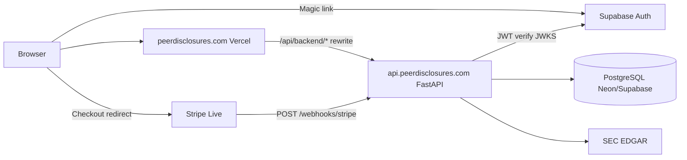

# PeerDisclosures — production deployment guide

Step-by-step guide for launching **peerdisclosures.com** with Vercel (frontend), a hosted FastAPI API (**api.peerdisclosures.com**), managed PostgreSQL, Supabase Auth, and Stripe Live mode.

**Related docs:** [GO_LIVE_CHECKLIST.md](./GO_LIVE_CHECKLIST.md) · [STRIPE_SETUP.md](./STRIPE_SETUP.md) · [SETUP_RUNBOOK.md](./SETUP_RUNBOOK.md) · [.env.production.example](../.env.production.example)

---

## Recommended stack

| Layer | Recommendation | Why |
|---|---|---|
| **Frontend** | [Vercel](https://vercel.com) | Native Next.js 14, HTTPS, env secrets, `vercel.json` included |
| **API** | [Railway](https://railway.app) or [Render](https://render.com) | Deploy `backend/Dockerfile`, attach Postgres or external DB, persistent volume for filing cache |
| **Database** | [Neon](https://neon.tech) or [Supabase Postgres](https://supabase.com/docs/guides/database) | Managed Postgres, SSL, automated backups on paid tiers |
| **Auth** | Supabase (existing project) | Magic link only — app data stays in your `DATABASE_URL` Postgres |
| **Billing** | Stripe Live | Checkout + Customer Portal + webhooks (already in code) |
| **DNS** | Registrar → Vercel + API host | Apex/`www` → Vercel; `api` CNAME → Railway/Render/Fly |

**Alternative API hosts:** Fly.io (`fly launch` + `backend/Dockerfile`), Docker on a VPS (`docker compose --profile full`), or Render Web Service.

---

## Architecture (production)



Browser API calls use **`/api/backend`** (same origin) — configured in `next.config.mjs` via `NEXT_PUBLIC_API_URL` at build time. Direct calls to `api.peerdisclosures.com` still work for webhooks and health probes.

---

## Phase 1 — Domain & DNS

### 1. Register and configure peerdisclosures.com

1. Register **peerdisclosures.com** at your registrar (or transfer existing domain).
2. Add domain in **Vercel** → Project → Settings → Domains:
   - `peerdisclosures.com` (apex)
   - `www.peerdisclosures.com` (optional — `vercel.json` redirects www → apex)
3. Point DNS per Vercel instructions (A/AAAA or CNAME). HTTPS is automatic.

### 2. API subdomain

Create **`api.peerdisclosures.com`** pointing to your API host:

| Host | Record | Target |
|---|---|---|
| Railway | CNAME | `<service>.up.railway.app` |
| Render | CNAME | `<service>.onrender.com` |
| Fly.io | A/AAAA | Fly app IP(s) |
| VPS | A | Server IP (reverse proxy → :8000) |

Enable HTTPS on the API host (Railway/Render/Fly provide this; on VPS use Caddy/nginx + Let's Encrypt).

---

## Phase 2 — Database

### Option A — Neon (recommended for app DB)

1. [console.neon.tech](https://console.neon.tech) → New project → region near users.
2. Copy connection string → `DATABASE_URL` (include `?sslmode=require`).
3. **Backups:** Neon Free = PITR limited; enable **paid** plan or export for production SLAs. See [DB backups](#database-backups) below.

### Option B — Supabase Postgres

Use the **database connection string** from Supabase → Project Settings → Database (not the pooler unless you configure SQLAlchemy for it).

> Auth and app DB can share one Supabase project, but PeerDisclosures defaults to a **separate** `DATABASE_URL` for users/orgs/tiers. Either approach works.

### Run migrations (before first traffic)

```powershell
cd backend
$env:DATABASE_URL = "postgresql://..."   # production URL
.\.venv\Scripts\python.exe -m alembic upgrade head
```

Do **not** rely on `init_db()` in production — Alembic is the source of truth.

---

## Phase 3 — Backend API

### Railway (example)

1. [railway.app/new](https://railway.app/new) → Deploy from GitHub repo.
2. Set **Root directory** / **Dockerfile path:** `backend/Dockerfile` (build context `backend/`).
3. Add **Volume** mount at `/app/.cache` for filing cache (optional but improves cold starts).
4. Set **Custom domain:** `api.peerdisclosures.com`.
5. Paste env vars from [.env.production.example](../.env.production.example) (backend section).
6. Deploy → verify `GET https://api.peerdisclosures.com/health` → `{"status":"ok",...}`.

### Render (example)

1. [dashboard.render.com](https://dashboard.render.com) → New **Web Service** → connect repo.
2. **Environment:** Docker · **Dockerfile path:** `backend/Dockerfile`.
3. **Health check path:** `/health`
4. Add env vars + attach **Persistent Disk** at `/app/.cache` if available.
5. Custom domain `api.peerdisclosures.com`.

### Docker on VPS

```bash
docker build -t filinggrid-api ./backend
docker run -d -p 8000:8000 --env-file backend/.env \
  -v filinggrid_cache:/app/.cache \
  --name filinggrid-api filinggrid-api
```

Put Caddy/nginx in front with TLS and proxy to `:8000`.

### Required backend env vars

| Variable | Production value |
|---|---|
| `DATABASE_URL` | Managed Postgres URL (SSL) |
| `SUPABASE_URL` | `https://YOUR_PROJECT.supabase.co` |
| `STRIPE_SECRET_KEY` | `sk_live_...` |
| `STRIPE_WEBHOOK_SECRET` | From live webhook endpoint |
| `STRIPE_PRICE_PROFESSIONAL` | Live `price_...` |
| `APP_URL` | `https://peerdisclosures.com` |
| `CORS_ORIGINS` | `https://peerdisclosures.com` |
| `SEC_USER_AGENT` | `PeerDisclosures/1.0 (ops@peerdisclosures.com)` |
| `ALLOW_DEV_TIER_TOGGLE` | **`false`** (or omit) |
| `DEV_PRO_TIER` | **`false`** (or omit) |

---

## Phase 4 — Frontend (Vercel)

1. [vercel.com/new](https://vercel.com/new) → Import GitHub repo.
2. Framework: **Next.js** (auto-detected; `vercel.json` included).
3. **Production environment variables:**

| Variable | Value |
|---|---|
| `NEXT_PUBLIC_APP_URL` | `https://peerdisclosures.com` |
| `NEXT_PUBLIC_API_URL` | `https://api.peerdisclosures.com` |
| `NEXT_PUBLIC_SUPABASE_URL` | Your Supabase project URL |
| `NEXT_PUBLIC_SUPABASE_ANON_KEY` | Publishable or anon key |
| `NEXT_PUBLIC_STRIPE_PUBLISHABLE_KEY` | `pk_live_...` (optional) |

4. **Do not set** `NEXT_PUBLIC_ALLOW_DEV_TIER_TOGGLE` or `NEXT_PUBLIC_DEV_TIER`.
5. Deploy → verify:
   - `https://peerdisclosures.com` loads
   - `https://peerdisclosures.com/api/backend/health` → `{"status":"ok"}`

---

## Phase 5 — Supabase (production URLs)

Dashboard: [supabase.com/dashboard](https://supabase.com/dashboard) → your project → **Authentication → URL configuration**

| Setting | Value |
|---|---|
| **Site URL** | `https://peerdisclosures.com` |
| **Redirect URLs** | Add each line below |

```
https://peerdisclosures.com/auth/callback
https://peerdisclosures.com/**
```

Optional (preview/staging):

```
https://*.vercel.app/auth/callback
```

### Magic link email branding

**Authentication → Email Templates → Magic Link** — see [SETUP_RUNBOOK.md § 2d](./SETUP_RUNBOOK.md#2d-magic-link-email-template-go-live-branding).

### Custom SMTP (recommended for deliverability)

**Project Settings → Authentication → SMTP Settings** — send from `noreply@peerdisclosures.com` via Resend/SendGrid/SES. See [SETUP_RUNBOOK.md § 2e](./SETUP_RUNBOOK.md#2e-custom-smtp-optional--send-from-peerdisclosurescom).

---

## Phase 6 — Stripe Live

Complete in order:

1. **Business verification** — [dashboard.stripe.com/account/onboarding](https://dashboard.stripe.com/account/onboarding)
2. Switch to **Live mode** (toggle top-right).
3. **Product** — [dashboard.stripe.com/products](https://dashboard.stripe.com/products) → **PeerDisclosures Professional** → **$29/mo** → copy live `price_...`.
4. **API keys** — [dashboard.stripe.com/apikeys](https://dashboard.stripe.com/apikeys) → `sk_live_...` → API host secret `STRIPE_SECRET_KEY`.
5. **Webhook** — [dashboard.stripe.com/webhooks](https://dashboard.stripe.com/webhooks) → **Add endpoint**:
   - **URL:** `https://api.peerdisclosures.com/webhooks/stripe`
   - **Events:**
     - `checkout.session.completed`
     - `customer.subscription.created`
     - `customer.subscription.updated`
     - `customer.subscription.deleted`
     - `invoice.payment_failed`
   - Copy **Signing secret** → `STRIPE_WEBHOOK_SECRET` on API host.
6. **Customer Portal** — [dashboard.stripe.com/settings/billing/portal](https://dashboard.stripe.com/settings/billing/portal) → Activate (live mode).
7. **Customer emails** — [dashboard.stripe.com/settings/emails](https://dashboard.stripe.com/settings/emails) → enable receipts + failed payment emails.

Full detail: [STRIPE_SETUP.md](./STRIPE_SETUP.md).

---

## Phase 7 — SEC EDGAR

Set on the **API host** only:

```env
SEC_USER_AGENT=PeerDisclosures/1.0 (ops@peerdisclosures.com)
```

Use a **real monitored inbox** (`ops@`, `support@`, or `legal@`). Required by [SEC fair access policy](https://www.sec.gov/os/webmaster-faq#code-support).

Optional post-deploy cache warm:

```powershell
cd backend
$env:DATABASE_URL = "..."   # if script needs DB
.\.venv\Scripts\python.exe scripts/prewarm_cache.py
```

---

## Phase 8 — Email mailboxes (legal / support)

These addresses appear in the app and legal pages — they must **receive mail**:

| Address | Used in |
|---|---|
| `support@peerdisclosures.com` | Footer, magic link template |
| `legal@peerdisclosures.com` | `/terms` |
| `privacy@peerdisclosures.com` | `/privacy` |
| `ops@peerdisclosures.com` | Recommended for `SEC_USER_AGENT` |
| `noreply@peerdisclosures.com` | Supabase custom SMTP sender (optional) |

**Your action:** Configure MX records at your DNS provider (Google Workspace, Microsoft 365, Fastmail, etc.) or forwarding aliases at your registrar. Test with an inbound message to each address before launch.

---

## Phase 9 — Production smoke test

### Automated (HTTP probes)

```powershell
cd backend
.\.venv\Scripts\python.exe scripts/prod_smoke_check.py `
  --api https://api.peerdisclosures.com `
  --app https://peerdisclosures.com
```

Checks: API `/health`, Vercel `/api/backend/health` proxy, `/dev/tier` → 404, ticker search.

### Manual E2E (billing)

Full browser checklist: **[PRODUCTION_SMOKE_TEST.md](./PRODUCTION_SMOKE_TEST.md)** (checkout → webhook → Pro → portal cancel).

Local automated billing path (test keys + running API):

```powershell
cd backend
.\.venv\Scripts\python.exe scripts/signup_e2e_automated.py
# With API on :8000 and Stripe test env:
.\.venv\Scripts\python.exe scripts/e2e_checkout_test.py
```

---

## Database backups

| Provider | Default | Recommendation |
|---|---|---|
| **Neon** | Free: limited PITR; Pro: 7–30 day PITR | Enable paid PITR for production; document restore runbook |
| **Supabase** | Daily backups on Pro plan | Upgrade from Free for production; [Database Backups](https://supabase.com/docs/guides/platform/backups) |
| **Railway Postgres** | Snapshots on paid plans | Enable automatic backups in Railway dashboard |
| **RDS / self-hosted** | Configure automated snapshots | Daily snapshot + test restore quarterly |

**Minimum for go-live:** confirm your Postgres tier includes **automated daily backups** and you know how to restore. Export a manual `pg_dump` before first live Stripe charge as a belt-and-suspenders step:

```bash
pg_dump "$DATABASE_URL" -Fc -f filinggrid-prelaunch.dump
```

---

## Error monitoring (optional — Sentry)

Sentry is **not wired in code yet** (no `@sentry/*` dependencies). When ready:

1. Create projects at [sentry.io](https://sentry.io) — one for Next.js, one for FastAPI.
2. Add env vars (documented in `.env.production.example`):
   - `SENTRY_DSN` (backend)
   - `NEXT_PUBLIC_SENTRY_DSN` (frontend)
3. Install SDKs and initialize in `backend/main.py` and `app/layout.tsx` in a follow-up PR.

Until then, monitor via:
- Vercel → Deployments / Functions logs
- API host logs (Railway/Render)
- Stripe Dashboard → Webhooks → failed deliveries (Stripe emails on failures)

---

## Pre-launch security checklist

- [ ] All secrets in host secret managers (never in git)
- [ ] `ALLOW_DEV_TIER_TOGGLE=false` on API — `POST /dev/tier` returns **404**
- [ ] No `NEXT_PUBLIC_ALLOW_DEV_TIER_TOGGLE` on Vercel
- [ ] `CORS_ORIGINS` lists only production frontend origin(s)
- [ ] `APP_URL` and `NEXT_PUBLIC_APP_URL` match live domain (HTTPS)
- [ ] Live Stripe keys paired with **live** price ID and **live** webhook secret
- [ ] Supabase Site URL + redirect URLs use `https://peerdisclosures.com`
- [ ] `SEC_USER_AGENT` uses real contact email
- [ ] Legal/support mailboxes receive inbound mail
- [ ] Database migrations applied (`alembic upgrade head`)
- [ ] DB backups enabled on paid/automated tier

---

## Troubleshooting

| Symptom | Fix |
|---|---|
| `/api/backend/health` fails on Vercel | Rebuild after setting `NEXT_PUBLIC_API_URL`; check API host is up |
| Magic link redirect error | Supabase redirect URLs must include `https://peerdisclosures.com/auth/callback` |
| CORS error in browser | Add frontend origin to API `CORS_ORIGINS` |
| Paid but still Free | Live webhook URL wrong or secret mismatch; check Stripe webhook log |
| `503 Billing is not configured` | Missing `STRIPE_SECRET_KEY` or `STRIPE_PRICE_PROFESSIONAL` on API |
| SEC 403 / blocked | Set valid `SEC_USER_AGENT` with real email |
| Dev toggle visible in prod | Remove `NEXT_PUBLIC_ALLOW_DEV_TIER_TOGGLE`; confirm production build (`NODE_ENV=production`) |

---

## Related documentation

- [GO_LIVE_CHECKLIST.md](./GO_LIVE_CHECKLIST.md) — week-by-week launch timeline
- [PRODUCTION_SMOKE_TEST.md](./PRODUCTION_SMOKE_TEST.md) — manual billing E2E
- [STRIPE_SETUP.md](./STRIPE_SETUP.md) — Stripe Dashboard detail
- [TIER_TESTING.md](./TIER_TESTING.md) — staging only (dev toggles)
