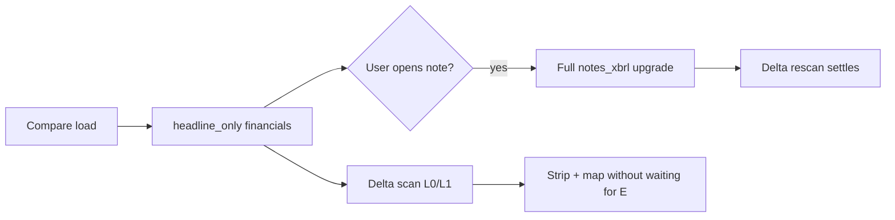

# XBRL usage in Peer Disclosures

**Last updated:** 2026-06-29  
**Branch:** `delta-phase-1` (Phase 1.5 XBRL delta rules)

This document maps where tagged SEC filing data (companyfacts, iXBRL) is used internally. User-facing copy never says "XBRL."

---

## Backend pipeline

| Component | Path | Role |
|-----------|------|------|
| XBRL client | `backend/sec/xbrl_client.py` | Fetches companyfacts; extracts headline metrics, GAAP statement rows, and `notes_xbrl` (per-note metrics + disclosure text blocks) |
| Note metrics map | `NOTE_SECTION_METRICS` | Section id → metric keys and candidate us-gaap / ifrs-full concepts |
| Note text blocks | `NOTE_SECTION_TEXT_BLOCKS` | Section id → narrative text block concepts for iXBRL HTML extraction |
| IFRS aliases | `_IFRS_NOTE_CONCEPT_ALIASES` | Appended to note metric candidates for 20-F / 6-K foreign footnotes |
| Headline fast path | `headline_only: true` | Returns `annual_summary` + empty `notes_xbrl` without note disclosure scan |

---

## Frontend data model

| Field | Type | Meaning |
|-------|------|---------|
| `FinancialsXbrl.annual_summary` | FY rows | Headline metrics (revenue, net income, EPS, etc.) |
| `FinancialsXbrl.notes_xbrl[sectionId]` | `NoteSectionXbrl` | Per-footnote tagged amounts + optional disclosure text |
| `NoteSectionXbrl.has_data` | boolean | Tagged amounts and/or disclosure blocks present |
| `NoteSectionXbrl.disclosures[]` | text blocks | iXBRL narrative extracted from filing HTML |
| `FinancialsXbrl.headline_only` | boolean | Note scan deferred; full upgrade triggered on demand |

---

## Performance model

- **Headline scan:** Delta rules run on parse index + headline `annual_summary` + partial `notes_xbrl` when already cached. No new SEC API calls in the delta scan path.
- **Full notes upgrade:** Background fetch when user navigates to a note or when headline batch returns empty `notes_xbrl`. Re-triggers delta settle via `computeDeltasSettling` / compare-settling logic.
- **Rules gated on pending notes:** `financialsNotesXbrlPending()` excludes peers from `missing_section` until note XBRL is scanned.

---

## Delta rules — ruleId → data source

| ruleId | Level | XBRL-backed? | Data source |
|--------|-------|--------------|-------------|
| `headline_vs_median` | L0 | Yes | `annual_summary` / quarterly metrics |
| `headline_only_peer` | L0 | Yes | Headline metrics (negative NI / EPS) |
| `note_metric_vs_median` | L1 | Yes | `notes_xbrl[section].annual_summary` metric keys (Phase 1.5) |
| `topic_only_peer` | L1 | Partial | Dollar-event notes: non-zero FY tagged amounts; governance: parse preview |
| `missing_section` | L1 | Partial | Parse index + `financialsHaveCatalogSection()` |
| `contingency_open_emphasis` | L1 | Partial | `notes_xbrl.disclosures[].text` when present, else parse preview; note-contingencies requires non-zero FY metrics |
| `prose_number_gap` | L1 | Yes | Note in parse index but `notes_xbrl[section].has_data === false` |
| `open_staff_comments` | L1 | No | Parse preview (Item 1B) |
| `only_peer_open_staff` | L0 | No | Parse preview |
| `disagreement_reported` | L1 | No | Parse preview (Item 9) |
| `metrics_not_comparable_mixed_filers` | L0 | N/A | Form mix + source mix guard |

### Phase 1.5: `note_metric_vs_median`

Scans high-signal footnote sections when `metricsComparable()` is true:

- `note-leases`, `note-revenue`, `note-goodwill`, `note-restructuring`, `note-segments`
- `note-impairment`, `note-debt`, `note-stock-comp`, `note-contingencies`, `note-acquisitions`

For each metric key with non-zero FY values in ≥2 peers, flags tickers above 1.5× (or 1.35× interim) or below 0.5× (0.65× interim) of peer median — same thresholds as `headline_vs_median`.

---

## Section presence & navigation

| Helper | Path | Role |
|--------|------|------|
| `financialsHaveCatalogSection` | `lib/section-presence.ts` | Note present when tagged amounts or disclosures exist |
| `xbrlNoteSectionsWithTaggedData` | `lib/section-presence.ts` | Collects section ids with `has_data` for nav |
| `getComparableSectionIds` | `lib/sections.ts` | Merges parse index + optional XBRL extra ids |
| Compare nav | `CompareGrid.tsx` | `availableSectionIds` includes XBRL `has_data` note sections |

---

## UI panels (non-delta)

| Surface | XBRL use |
|---------|----------|
| Filing column — financial statements | Headline metrics table from `annual_summary` |
| Filing column — note sections | `notes_xbrl` metrics table + inline disclosure text |
| Pro GAAP statements | Full statement tables from companyfacts |

---

## What is NOT XBRL-backed

- **Narrative Items:** Business, Risk Factors, MD&A, Properties, Mine Safety — parse index + HTML excerpt only
- **Governance delta rules:** `open_staff_comments`, `disagreement_reported`, `only_peer_open_staff` — text preview rules
- **Legal proceedings (topic presence):** substantive parse preview
- **Dimension / segment XBRL compare:** not implemented (performance / low user value)
- **Extension taxonomy mapping, calculation link validation:** not implemented
- **Cross-currency normalization, real-time companyfacts refresh:** not implemented

---

## Skipped from XBRL assessment (ed1cdaca)

| Item | Reason |
|------|--------|
| Dimension/segment compare | Performance; complex; low mainstream value |
| Extension taxonomy mapping | Heavy backend; marginal delta value |
| Calculation link validation | No user-facing delta benefit |
| XBRL for MD&A / risk / Item 9 narrative | Text rules sufficient; full HTML upgrade path preferred |
| Real-time companyfacts refresh | Unnecessary API load |
| Cross-currency normalization | Scope creep for mixed filers |
| Lazy per-note disclosure fetch | Medium effort; would block headline-first settle |
| Headline `operating_cash_flow` expansion | Not in headline `METRIC_CONCEPTS` fast path |
